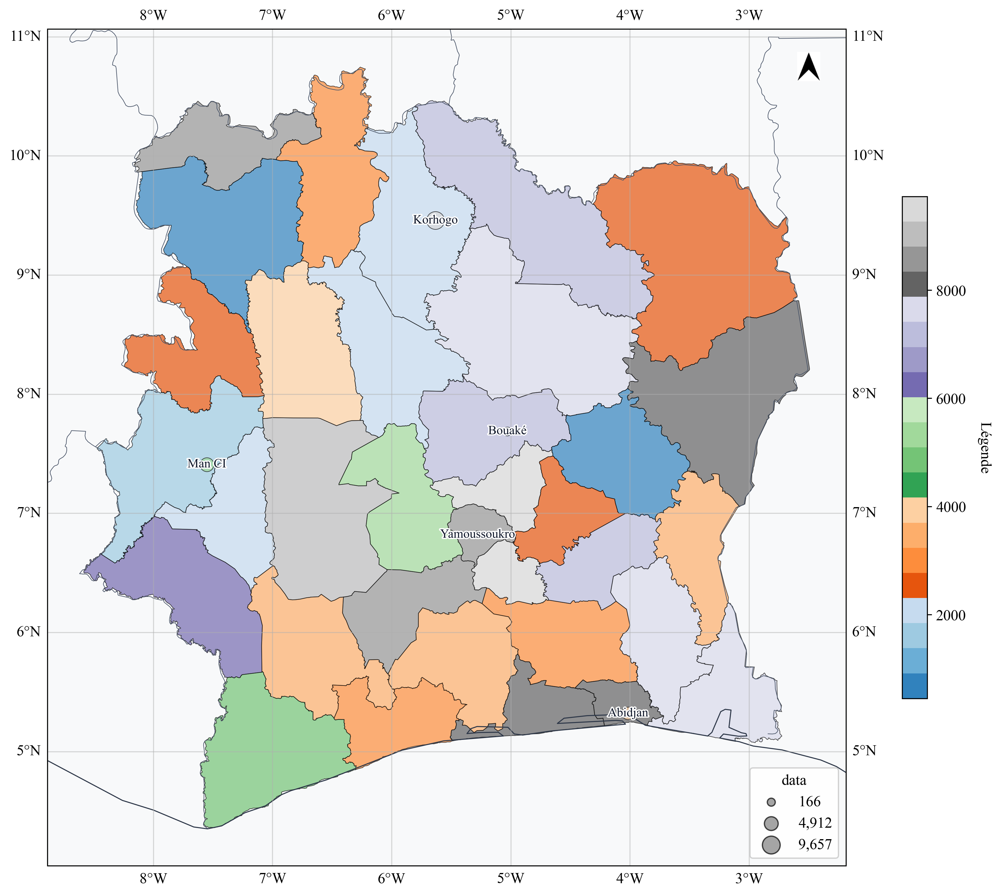
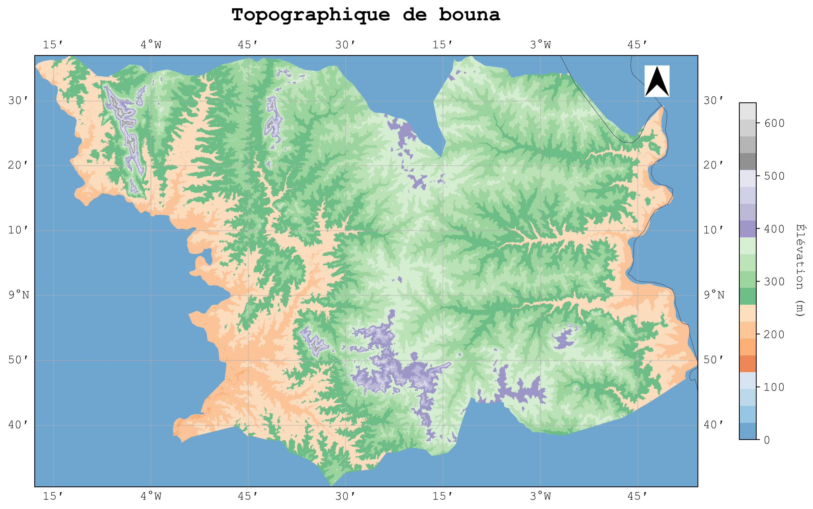
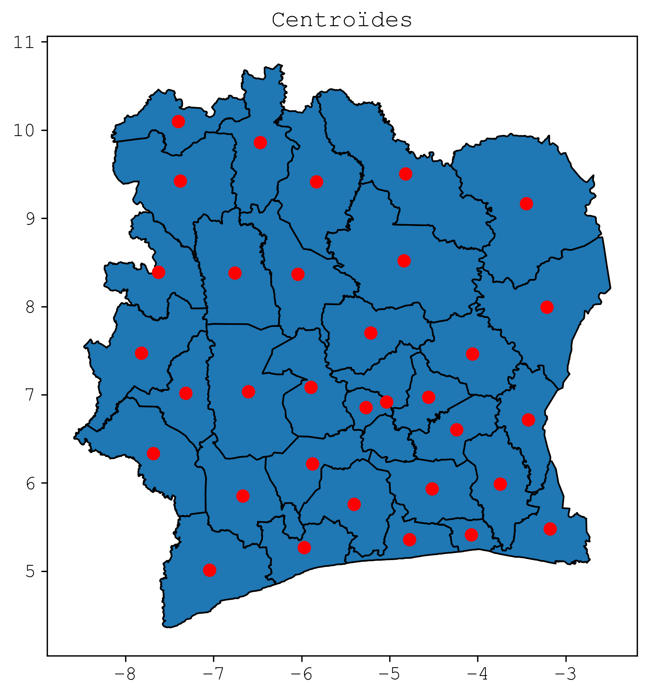

# **PRESENTATION**


Cartograpy est un package python qui permet de manipuler des données
geographiques et de creer des cartes simplement.

# **FONCTIONNALITE**

-   Telecharger des données de découpage administratif de pays
-   Importer des données de types vectorielles et matricielles
-   Faire des traitement sur les données geospatiales importé
-   Creer des cartes et les personnaliser simplement

# **INSTALLATION**

Pour installer le package cartograpy, vous pouvez utiliser pip. Ouvrez
votre terminal ou invite de commande et exécutez la commande suivante :

``` bash
pip install cartograpy
```

# **UTILISATION**

## **Obtension de données géographiques**

### *Récupérer les limites administratives d’un ou plusieurs pays*

``` python
# Importation
from cartograpy import data
client = data.GeoBoundaries()
```

**Les niveau de subbdivision administrative disponibles sont :**

Il existe 5 subdivisions administratives disponibles :

``` python
print(client.adminLevels())
```


    | Niveau GeoBoundaries | Nom commun (FR)           | Nom commun (EN)       |
    | -------------------- | ------------------------- | --------------------- |
    | ADM0                 | Pays                      | Country               |
    | ADM1                 | Région / État / Province  | State / Region        |
    | ADM2                 | Département / District    | District / County     |
    | ADM3                 | Sous-préfecture / Commune | Subdistrict / Commune |
    | ADM4                 | Village / Localité        | Village / Locality    |
    | ADM5                 | Quartier / Secteur        | Neighborhood / Sector |
            

**Remarques importantes :**

-   Le nombre de niveaux dépend du pays. Certains pays s’arrêtent à
    ADM2, d’autres vont jusqu’à ADM4 ou ADM5.
-   Le nom réel des subdivisions varie d’un pays à l’autre (ex :
    “State”, “Region”, “Province”, “Department”, etc.).
-   GeoBoundaries propose toujours au moins le niveau ADM0 (frontière
    nationale).

Pour savoir si un niveau administratif est disponible pour un pays, vous
pouvez utiliser la méthode `is_valid_adm` de l’objet `GeoBoundaries`.
Voici un exemple :

``` python
print(client.is_valid_adm("CIV","ADM1"))  # Exemple pour vérifier si le niveau ADM1 est valide pour la Côte d'Ivoire
# Ou encore
print(client._get_smallest_adm("CIV"))  # Exemple pour vérifier si le niveau admin minimum pour la Côte d'Ivoire
```

    True
    Smallest ADM level found for CIV : ADM3
    ADM3

**Les codes des pays sont conformes à la norme ISO 3166-1 alpha-3 :**

Pour obtenir la liste des pays valides, vous pouvez utiliser la méthode
`countries()` de l’objet `GeoBoundaries`. Voici un exemple :

``` python
client.countries()[0:10]  # Affiche les 10 premiers pays
```

    ['أفغانستان',
     'афганистан',
     'afghánistán',
     'afghanistan',
     'αφγανιστάν',
     'afganio',
     'afganistán',
     'afganistan',
     'afganisztán',
     'աֆղանստան']

``` python
client.get_iso3("burk")
```

    'BFA'

``` python
client.get_iso3("con")  # Exemple pour obtenir le code ISO d'un pays
```

    [('congo', 'cog'),
     ('república del congo', 'cog'),
     ('république du congo', 'cog'),
     ('rep. del congo', 'cog'),
     ('congo-brazzaville', 'cog'),
     ('república do congo', 'cog'),
     ('demokratiske republik congo', 'cod'),
     ('congo, democratic republic of the', 'cod'),
     ('república democrática del congo', 'cod'),
     ('république démocratique du congo', 'cod'),
     ('rd del congo', 'cod'),
     ('congo-kinshasa', 'cod'),
     ('república democrática do congo', 'cod'),
     ('republica democrată congo', 'cod')]

``` python

# Exemple 1: Récupérer les données administratives des régions de la cote d'ivoire
civ_data = client.adm("CIV", "ADM2")
civ_data.head()
```

<div>
<style scoped>
    .dataframe tbody tr th:only-of-type {
        vertical-align: middle;
    }

    .dataframe tbody tr th {
        vertical-align: top;
    }

    .dataframe thead th {
        text-align: right;
    }
</style>

<table class="dataframe" data-quarto-postprocess="true" data-border="1">
<thead>
<tr style="text-align: right;">
<th data-quarto-table-cell-role="th"></th>
<th data-quarto-table-cell-role="th">geometry</th>
<th data-quarto-table-cell-role="th">shapeName</th>
<th data-quarto-table-cell-role="th">shapeISO</th>
<th data-quarto-table-cell-role="th">shapeID</th>
<th data-quarto-table-cell-role="th">shapeGroup</th>
<th data-quarto-table-cell-role="th">shapeType</th>
</tr>
</thead>
<tbody>
<tr>
<td data-quarto-table-cell-role="th">0</td>
<td>POLYGON ((-4.68451 6.27179, -4.6868 6.26883, -...</td>
<td>Agneby-Tiassa</td>
<td></td>
<td>98640826B52449815511854</td>
<td>CIV</td>
<td>ADM2</td>
</tr>
<tr>
<td data-quarto-table-cell-role="th">1</td>
<td>POLYGON ((-7.71925 9.07004, -7.72574 9.06397, ...</td>
<td>Bafing</td>
<td></td>
<td>98640826B37750272367318</td>
<td>CIV</td>
<td>ADM2</td>
</tr>
<tr>
<td data-quarto-table-cell-role="th">2</td>
<td>POLYGON ((-6.19702 10.24246, -6.20038 10.24495...</td>
<td>Bagoue</td>
<td></td>
<td>98640826B26044148659027</td>
<td>CIV</td>
<td>ADM2</td>
</tr>
<tr>
<td data-quarto-table-cell-role="th">3</td>
<td>MULTIPOLYGON (((-4.68451 6.27179, -4.68338 6.2...</td>
<td>Belier</td>
<td></td>
<td>98640826B5123145245776</td>
<td>CIV</td>
<td>ADM2</td>
</tr>
<tr>
<td data-quarto-table-cell-role="th">4</td>
<td>POLYGON ((-6.70042 9.06196, -6.70118 9.05639, ...</td>
<td>Bere</td>
<td></td>
<td>98640826B43857880322183</td>
<td>CIV</td>
<td>ADM2</td>
</tr>
</tbody>
</table>

</div>

``` python
# Exemple 2 : Récupérer les limites administratives de plusieurs pays (senegal et mali ici)
countries_data = client.adm(["SEN", "mali"], "ADM2")
countries_data["mali"].head()
```

<div>
<style scoped>
    .dataframe tbody tr th:only-of-type {
        vertical-align: middle;
    }

    .dataframe tbody tr th {
        vertical-align: top;
    }

    .dataframe thead th {
        text-align: right;
    }
</style>

<table class="dataframe" data-quarto-postprocess="true" data-border="1">
<thead>
<tr style="text-align: right;">
<th data-quarto-table-cell-role="th"></th>
<th data-quarto-table-cell-role="th">geometry</th>
<th data-quarto-table-cell-role="th">shapeName</th>
<th data-quarto-table-cell-role="th">shapeISO</th>
<th data-quarto-table-cell-role="th">shapeID</th>
<th data-quarto-table-cell-role="th">shapeGroup</th>
<th data-quarto-table-cell-role="th">shapeType</th>
</tr>
</thead>
<tbody>
<tr>
<td data-quarto-table-cell-role="th">0</td>
<td>POLYGON ((-7.92938 12.68171, -7.93554 12.68821...</td>
<td>Bamako</td>
<td></td>
<td>8926073B70420899930674</td>
<td>MLI</td>
<td>ADM2</td>
</tr>
<tr>
<td data-quarto-table-cell-role="th">1</td>
<td>POLYGON ((1.32448 16.90639, 1.03227 16.61402, ...</td>
<td>Ansongo</td>
<td></td>
<td>8926073B56917716124995</td>
<td>MLI</td>
<td>ADM2</td>
</tr>
<tr>
<td data-quarto-table-cell-role="th">2</td>
<td>POLYGON ((1.17767 17.69958, 1.15458 17.70648, ...</td>
<td>Bourem</td>
<td></td>
<td>8926073B86504284097699</td>
<td>MLI</td>
<td>ADM2</td>
</tr>
<tr>
<td data-quarto-table-cell-role="th">3</td>
<td>POLYGON ((1.32448 16.90639, 1.65353 17.5735, 1...</td>
<td>Gao</td>
<td></td>
<td>8926073B84061132695750</td>
<td>MLI</td>
<td>ADM2</td>
</tr>
<tr>
<td data-quarto-table-cell-role="th">4</td>
<td>POLYGON ((1.31144 15.27381, 1.4716 15.28167, 1...</td>
<td>Menaka</td>
<td></td>
<td>8926073B3742503303790</td>
<td>MLI</td>
<td>ADM2</td>
</tr>
</tbody>
</table>

</div>

### Récupérer les métadonnées d’un territoire

``` python

# Récupérer les métadonnées d'un territoire
metadata_civ = client.metadata("CIV", "ADM0")


print(f"Métadonnées disponibles pour la Côte d'Ivoire: {metadata_civ.keys()}")
```

    Métadonnées disponibles pour la Côte d'Ivoire: dict_keys(['boundaryID', 'boundaryName', 'boundaryISO', 'boundaryYearRepresented', 'boundaryType', 'boundaryCanonical', 'boundarySource', 'boundaryLicense', 'licenseDetail', 'licenseSource', 'boundarySourceURL', 'sourceDataUpdateDate', 'buildDate', 'Continent', 'UNSDG-region', 'UNSDG-subregion', 'worldBankIncomeGroup', 'admUnitCount', 'meanVertices', 'minVertices', 'maxVertices', 'meanPerimeterLengthKM', 'minPerimeterLengthKM', 'maxPerimeterLengthKM', 'meanAreaSqKM', 'minAreaSqKM', 'maxAreaSqKM', 'staticDownloadLink', 'gjDownloadURL', 'tjDownloadURL', 'imagePreview', 'simplifiedGeometryGeoJSON'])

``` python
metadata_civ["Continent"]
```

    'Africa'

``` python
metadata_civ["UNSDG-subregion"]
```

    'Western Africa'

``` python
metadata_civ["UNSDG-region"]
```

    'Sub-Saharan Africa'

``` python
url_img=metadata_civ["imagePreview"]
url_img
```

    'https://github.com/wmgeolab/geoBoundaries/raw/9469f09/releaseData/gbOpen/CIV/ADM0/geoBoundaries-CIV-ADM0-PREVIEW.png'

``` python
# Afficher l'image de prévisualisation dans le notebook
from IPython.display import Image, display

try :
    display(Image(url=url_img))
except :
    print("Impossible d'afficher l'image.")
```


### *Géocoder une ou plusieurs adresses*

Le geocodage permet de convertir des adresses en coordonnées
géographiques (latitude et longitude). Vous pouvez géocoder une ou
plusieurs adresses en utilisant les méthode `geocode` et `geocode_batch`
de l’objet `Geocoder`.

``` python
from cartograpy import data
geocoder= data.Geocoder()
```

**Géocoder une adresse**

``` python
address = "bouaké"
result = geocoder.geocode(address)

# Adresse trouvée
result[0]
```

    Début du géocodage de 1 localité(s)...
    Géocodage terminé.

<div>
<style scoped>
    .dataframe tbody tr th:only-of-type {
        vertical-align: middle;
    }

    .dataframe tbody tr th {
        vertical-align: top;
    }

    .dataframe thead th {
        text-align: right;
    }
</style>

<table class="dataframe" data-quarto-postprocess="true" data-border="1">
<thead>
<tr style="text-align: right;">
<th data-quarto-table-cell-role="th"></th>
<th data-quarto-table-cell-role="th">query</th>
<th data-quarto-table-cell-role="th">address</th>
<th data-quarto-table-cell-role="th">latitude</th>
<th data-quarto-table-cell-role="th">longitude</th>
<th data-quarto-table-cell-role="th">altitude</th>
<th data-quarto-table-cell-role="th">raw</th>
<th data-quarto-table-cell-role="th">geometry</th>
</tr>
</thead>
<tbody>
<tr>
<td data-quarto-table-cell-role="th">0</td>
<td>bouaké</td>
<td>Bouaké, Gbêkê, Vallée du Bandama, Côte d’Ivoire</td>
<td>7.689021</td>
<td>-5.028355</td>
<td>0.0</td>
<td>{'place_id': 277285966, 'licence': 'Data © Ope...</td>
<td>POINT (-5.02836 7.68902)</td>
</tr>
</tbody>
</table>

</div>

``` python
# Adresse non trouvée
result[1]
```

    []

**Geocoder une liste d’adresses**

``` python
liste_adresses = ["Abidjan", "Yamoussoukro", "Bouaké", "Korhogo","Man CI", "","portbouet"]
results=geocoder.geocode(liste_adresses)

# Adresses trouvées
results[0]
```

    Début du géocodage de 7 localité(s)...
    Géocodage terminé.

<div>
<style scoped>
    .dataframe tbody tr th:only-of-type {
        vertical-align: middle;
    }

    .dataframe tbody tr th {
        vertical-align: top;
    }

    .dataframe thead th {
        text-align: right;
    }
</style>

<table class="dataframe" data-quarto-postprocess="true" data-border="1">
<thead>
<tr style="text-align: right;">
<th data-quarto-table-cell-role="th"></th>
<th data-quarto-table-cell-role="th">query</th>
<th data-quarto-table-cell-role="th">address</th>
<th data-quarto-table-cell-role="th">latitude</th>
<th data-quarto-table-cell-role="th">longitude</th>
<th data-quarto-table-cell-role="th">altitude</th>
<th data-quarto-table-cell-role="th">raw</th>
<th data-quarto-table-cell-role="th">geometry</th>
</tr>
</thead>
<tbody>
<tr>
<td data-quarto-table-cell-role="th">0</td>
<td>Abidjan</td>
<td>Abidjan, Le Plateau, Abidjan, Côte d’Ivoire</td>
<td>5.320357</td>
<td>-4.016107</td>
<td>0.0</td>
<td>{'place_id': 277113208, 'licence': 'Data © Ope...</td>
<td>POINT (-4.01611 5.32036)</td>
</tr>
<tr>
<td data-quarto-table-cell-role="th">1</td>
<td>Yamoussoukro</td>
<td>Yamoussoukro, Côte d’Ivoire</td>
<td>6.820007</td>
<td>-5.277603</td>
<td>0.0</td>
<td>{'place_id': 405157296, 'licence': 'Data © Ope...</td>
<td>POINT (-5.2776 6.82001)</td>
</tr>
<tr>
<td data-quarto-table-cell-role="th">2</td>
<td>Bouaké</td>
<td>Bouaké, Gbêkê, Vallée du Bandama, Côte d’Ivoire</td>
<td>7.689021</td>
<td>-5.028355</td>
<td>0.0</td>
<td>{'place_id': 277285966, 'licence': 'Data © Ope...</td>
<td>POINT (-5.02836 7.68902)</td>
</tr>
<tr>
<td data-quarto-table-cell-role="th">3</td>
<td>Korhogo</td>
<td>Korhogo, Poro, Savanes, Côte d’Ivoire</td>
<td>9.458070</td>
<td>-5.631629</td>
<td>0.0</td>
<td>{'place_id': 277168989, 'licence': 'Data © Ope...</td>
<td>POINT (-5.63163 9.45807)</td>
</tr>
<tr>
<td data-quarto-table-cell-role="th">4</td>
<td>Man CI</td>
<td>Man, Tonkpi, Montagnes, Côte d’Ivoire</td>
<td>7.410258</td>
<td>-7.550372</td>
<td>0.0</td>
<td>{'place_id': 276691276, 'licence': 'Data © Ope...</td>
<td>POINT (-7.55037 7.41026)</td>
</tr>
</tbody>
</table>

</div>

``` python
# Adresses non trouvée
results[1]
```

    ['', 'portbouet']

## **Visualisation de données**

cartograpy permet de creer rapidement des cartes pour visualier les
données géographiques.

``` python
from cartograpy.maper import *
```

``` python
# J'ajoute des données aléatoires pour la visualisation
import random
civ_data['data'] = [random.randint(0,10000) for i in range(len(civ_data))]
```

``` python
civ_data.head()
```

<div>
<style scoped>
    .dataframe tbody tr th:only-of-type {
        vertical-align: middle;
    }

    .dataframe tbody tr th {
        vertical-align: top;
    }

    .dataframe thead th {
        text-align: right;
    }
</style>

<table class="dataframe" data-quarto-postprocess="true" data-border="1">
<thead>
<tr style="text-align: right;">
<th data-quarto-table-cell-role="th"></th>
<th data-quarto-table-cell-role="th">geometry</th>
<th data-quarto-table-cell-role="th">shapeName</th>
<th data-quarto-table-cell-role="th">shapeISO</th>
<th data-quarto-table-cell-role="th">shapeID</th>
<th data-quarto-table-cell-role="th">shapeGroup</th>
<th data-quarto-table-cell-role="th">shapeType</th>
<th data-quarto-table-cell-role="th">data</th>
</tr>
</thead>
<tbody>
<tr>
<td data-quarto-table-cell-role="th">0</td>
<td>POLYGON ((-4.68451 6.27179, -4.6868 6.26883, -...</td>
<td>Agneby-Tiassa</td>
<td></td>
<td>98640826B52449815511854</td>
<td>CIV</td>
<td>ADM2</td>
<td>3060</td>
</tr>
<tr>
<td data-quarto-table-cell-role="th">1</td>
<td>POLYGON ((-7.71925 9.07004, -7.72574 9.06397, ...</td>
<td>Bafing</td>
<td></td>
<td>98640826B37750272367318</td>
<td>CIV</td>
<td>ADM2</td>
<td>2662</td>
</tr>
<tr>
<td data-quarto-table-cell-role="th">2</td>
<td>POLYGON ((-6.19702 10.24246, -6.20038 10.24495...</td>
<td>Bagoue</td>
<td></td>
<td>98640826B26044148659027</td>
<td>CIV</td>
<td>ADM2</td>
<td>2805</td>
</tr>
<tr>
<td data-quarto-table-cell-role="th">3</td>
<td>MULTIPOLYGON (((-4.68451 6.27179, -4.68338 6.2...</td>
<td>Belier</td>
<td></td>
<td>98640826B5123145245776</td>
<td>CIV</td>
<td>ADM2</td>
<td>9731</td>
</tr>
<tr>
<td data-quarto-table-cell-role="th">4</td>
<td>POLYGON ((-6.70042 9.06196, -6.70118 9.05639, ...</td>
<td>Bere</td>
<td></td>
<td>98640826B43857880322183</td>
<td>CIV</td>
<td>ADM2</td>
<td>2187</td>
</tr>
</tbody>
</table>

</div>

``` python
geocode_localite=results[0]
geocode_localite["data"]= [random.randint(0,10000) for i in range(len(geocode_localite))]
geocode_localite.head()
```

<div>
<style scoped>
    .dataframe tbody tr th:only-of-type {
        vertical-align: middle;
    }

    .dataframe tbody tr th {
        vertical-align: top;
    }

    .dataframe thead th {
        text-align: right;
    }
</style>

<table class="dataframe" data-quarto-postprocess="true" data-border="1">
<thead>
<tr style="text-align: right;">
<th data-quarto-table-cell-role="th"></th>
<th data-quarto-table-cell-role="th">query</th>
<th data-quarto-table-cell-role="th">address</th>
<th data-quarto-table-cell-role="th">latitude</th>
<th data-quarto-table-cell-role="th">longitude</th>
<th data-quarto-table-cell-role="th">altitude</th>
<th data-quarto-table-cell-role="th">raw</th>
<th data-quarto-table-cell-role="th">geometry</th>
<th data-quarto-table-cell-role="th">data</th>
</tr>
</thead>
<tbody>
<tr>
<td data-quarto-table-cell-role="th">0</td>
<td>Abidjan</td>
<td>Abidjan, Le Plateau, Abidjan, Côte d’Ivoire</td>
<td>5.320357</td>
<td>-4.016107</td>
<td>0.0</td>
<td>{'place_id': 277113208, 'licence': 'Data © Ope...</td>
<td>POINT (-4.01611 5.32036)</td>
<td>3721</td>
</tr>
<tr>
<td data-quarto-table-cell-role="th">1</td>
<td>Yamoussoukro</td>
<td>Yamoussoukro, Côte d’Ivoire</td>
<td>6.820007</td>
<td>-5.277603</td>
<td>0.0</td>
<td>{'place_id': 405157296, 'licence': 'Data © Ope...</td>
<td>POINT (-5.2776 6.82001)</td>
<td>166</td>
</tr>
<tr>
<td data-quarto-table-cell-role="th">2</td>
<td>Bouaké</td>
<td>Bouaké, Gbêkê, Vallée du Bandama, Côte d’Ivoire</td>
<td>7.689021</td>
<td>-5.028355</td>
<td>0.0</td>
<td>{'place_id': 277285966, 'licence': 'Data © Ope...</td>
<td>POINT (-5.02836 7.68902)</td>
<td>696</td>
</tr>
<tr>
<td data-quarto-table-cell-role="th">3</td>
<td>Korhogo</td>
<td>Korhogo, Poro, Savanes, Côte d’Ivoire</td>
<td>9.458070</td>
<td>-5.631629</td>
<td>0.0</td>
<td>{'place_id': 277168989, 'licence': 'Data © Ope...</td>
<td>POINT (-5.63163 9.45807)</td>
<td>9657</td>
</tr>
<tr>
<td data-quarto-table-cell-role="th">4</td>
<td>Man CI</td>
<td>Man, Tonkpi, Montagnes, Côte d’Ivoire</td>
<td>7.410258</td>
<td>-7.550372</td>
<td>0.0</td>
<td>{'place_id': 276691276, 'licence': 'Data © Ope...</td>
<td>POINT (-7.55037 7.41026)</td>
<td>5024</td>
</tr>
</tbody>
</table>

</div>

**Creer une carte cloropleth simple**

``` python
carte_ci=Map(figsize=(16, 12), projection=ccrs.PlateCarree())
carte_ci.add_vector_choropleth(geodf=civ_data,
                              column_to_plot='data',
                                title='Légende',
                                cmap='tab20c',
                                )
carte_ci.add_vector_points(
    geodf=geocode_localite,
    column_to_plot="data",
    label_column="query",
    point_size_column="data",
    show_colorbar=False,
    cmap="tab20c"
    
)

font_name=get_fonts("time")[0]
font_name
carte_ci.set_font(font_name, size=12)
carte_ci.add_arrow('cartograpy/svg/arrows/NorthArrow_11.svg', position=(-2.5,10.75),zoom=0.3, color="black")
carte_ci.figsize=(18,16)
```

    Warning: No CRS defined for geodf. Setting default CRS to EPSG:4326

    c:\Users\kanic\.virtualenvs\carto\Lib\site-packages\cartopy\mpl\feature_artist.py:144: UserWarning: facecolor will have no effect as it has been defined as "never".
      warnings.warn('facecolor will have no effect as it has been '
    Can't handle color: param(outline)
    Can't handle color: param(outline)
    Can't handle color: param(outline)
    Can't handle color: param(outline)
    Can't handle color: param(outline)
    Can't handle color: param(outline)
    Can't handle color: param(outline)
    Can't handle color: param(outline)
    Can't handle color: param(outline)
    Can't handle color: param(outline)
    Can't handle color: param(outline)
    Can't handle color: param(outline)
    Can't handle color: param(outline)
    Can't handle color: param(outline)
    Can't handle color: param(outline)
    Can't handle color: param(outline)
    Can't handle color: param(outline)
    Can't handle color: param(outline)
    Can't handle color: param(outline)
    Can't handle color: param(outline)
    Can't handle color: param(outline)
    Can't handle color: param(outline)
    Can't handle color: param(outline)
    Can't handle color: param(outline)
    Can't handle color: param(outline)
    Can't handle color: param(outline)
    Can't handle color: param(outline)
    Can't handle color: param(outline)
    Can't handle color: param(outline)
    Can't handle color: param(outline)
    Can't handle color: param(outline)
    Can't handle color: param(outline)
    Can't handle color: param(outline)



``` python
# Création d'une carte raster
carte = Map(figsize=(12, 8), projection=ccrs.PlateCarree())

# Ajout d'une couche raster
carte.add_raster('test\data\Limite DEM Bouna.tif', cmap='tab20c', title='Élévation (m)')

font_name=get_fonts("couri")[0]
font_name

carte.set_font(font_name, size=12)
carte.set_title('Topographique de bouna', fontsize=20, color='Black', pad=20)
carte.add_arrow('cartograpy/svg/arrows/NorthArrow_11.svg', position=(-2.70, 9.55), zoom=0.4, color='black')


# Sauvegarde
carte.save('carte_demo.png')
```

    <>:5: SyntaxWarning: invalid escape sequence '\d'
    <>:5: SyntaxWarning: invalid escape sequence '\d'
    C:\Users\kanic\AppData\Local\Temp\ipykernel_39904\3647050440.py:5: SyntaxWarning: invalid escape sequence '\d'
      carte.add_raster('test\data\Limite DEM Bouna.tif', cmap='tab20c', title='Élévation (m)')
    c:\Users\kanic\.virtualenvs\carto\Lib\site-packages\cartopy\mpl\feature_artist.py:144: UserWarning: facecolor will have no effect as it has been defined as "never".
      warnings.warn('facecolor will have no effect as it has been '
    Can't handle color: param(outline)
    Can't handle color: param(outline)
    Can't handle color: param(outline)
    Can't handle color: param(outline)
    Can't handle color: param(outline)
    Can't handle color: param(outline)
    Can't handle color: param(outline)
    Can't handle color: param(outline)
    Can't handle color: param(outline)
    Can't handle color: param(outline)
    Can't handle color: param(outline)
    Can't handle color: param(outline)
    Can't handle color: param(outline)
    Can't handle color: param(outline)
    Can't handle color: param(outline)
    Can't handle color: param(outline)
    Can't handle color: param(outline)
    Can't handle color: param(outline)
    Can't handle color: param(outline)
    Can't handle color: param(outline)
    Can't handle color: param(outline)
    Can't handle color: param(outline)
    Can't handle color: param(outline)
    Can't handle color: param(outline)
    Can't handle color: param(outline)
    Can't handle color: param(outline)
    Can't handle color: param(outline)
    Can't handle color: param(outline)
    Can't handle color: param(outline)
    Can't handle color: param(outline)
    Can't handle color: param(outline)
    Can't handle color: param(outline)
    Can't handle color: param(outline)

    'carte_demo.png'



``` python
carte.get_available_palettes()
```

    {'custom': [],
     'seaborn_qualitative': ['deep',
      'muted',
      'bright',
      'pastel',
      'dark',
      'colorblind',
      'Set1',
      'Set2',
      'Set3',
      'Paired',
      'tab10',
      'tab20'],
     'seaborn_sequential': ['Blues',
      'BuGn',
      'BuPu',
      'GnBu',
      'Greens',
      'Greys',
      'Oranges',
      'OrRd',
      'PuBu',
      'PuBuGn',
      'PuRd',
      'Purples',
      'RdPu',
      'Reds',
      'YlGn',
      'YlGnBu',
      'YlOrBr',
      'YlOrRd',
      'rocket',
      'mako',
      'flare',
      'crest'],
     'seaborn_diverging': ['BrBG',
      'PiYG',
      'PRGn',
      'PuOr',
      'RdBu',
      'RdGy',
      'RdYlBu',
      'RdYlGn',
      'Spectral',
      'coolwarm',
      'bwr',
      'seismic',
      'icefire',
      'vlag'],
     'matplotlib_sequential': ['viridis',
      'plasma',
      'inferno',
      'magma',
      'cividis',
      'Greys',
      'Purples',
      'Blues',
      'Greens',
      'Oranges',
      'Reds',
      'YlOrBr',
      'YlOrRd',
      'OrRd',
      'PuRd',
      'RdPu',
      'BuPu',
      'GnBu',
      'PuBu',
      'YlGnBu',
      'PuBuGn',
      'BuGn',
      'YlGn'],
     'matplotlib_diverging': ['PiYG',
      'PRGn',
      'BrBG',
      'PuOr',
      'RdGy',
      'RdBu',
      'RdYlBu',
      'RdYlGn',
      'Spectral',
      'coolwarm',
      'bwr',
      'seismic'],
     'matplotlib_cyclic': ['twilight', 'twilight_shifted', 'hsv'],
     'matplotlib_qualitative': ['Pastel1',
      'Pastel2',
      'Paired',
      'Accent',
      'Dark2',
      'Set1',
      'Set2',
      'Set3',
      'tab10',
      'tab20',
      'tab20b',
      'tab20c']}

``` python
from cartograpy.processing  import *
# Exemple d'utilisation
# Supposons que nous avons un GeoDataFrame de polygones appelé 'regions_gdf'
regions_centroids = centroids(civ_data)

# Maintenant regions_centroids est un GeoDataFrame de points (centroïdes)
# avec tous les attributs originaux de regions_gdf

# Vous pouvez vérifier le type de géométrie
print(regions_centroids.geometry.geom_type.unique())  # Devrait afficher ['Point']

# Visualisation
import matplotlib.pyplot as plt
fig, ax = plt.subplots( figsize=(14, 6), dpi=300)

civ_data.plot(ax=ax, edgecolor='black')
# ax.set_title('Polygones originaux')

regions_centroids.plot(ax=ax, markersize=50, color='red')
ax.set_title('Centroïdes')

plt.tight_layout()
plt.show()
```

    ['Point']



``` python
regions_centroids.head()
```

<div>
<style scoped>
    .dataframe tbody tr th:only-of-type {
        vertical-align: middle;
    }

    .dataframe tbody tr th {
        vertical-align: top;
    }

    .dataframe thead th {
        text-align: right;
    }
</style>

<table class="dataframe" data-quarto-postprocess="true" data-border="1">
<thead>
<tr style="text-align: right;">
<th data-quarto-table-cell-role="th"></th>
<th data-quarto-table-cell-role="th">geometry</th>
<th data-quarto-table-cell-role="th">shapeName</th>
<th data-quarto-table-cell-role="th">shapeISO</th>
<th data-quarto-table-cell-role="th">shapeID</th>
<th data-quarto-table-cell-role="th">shapeGroup</th>
<th data-quarto-table-cell-role="th">shapeType</th>
<th data-quarto-table-cell-role="th">data</th>
</tr>
</thead>
<tbody>
<tr>
<td data-quarto-table-cell-role="th">0</td>
<td>POINT (-4.51788 5.93541)</td>
<td>Agneby-Tiassa</td>
<td></td>
<td>98640826B52449815511854</td>
<td>CIV</td>
<td>ADM2</td>
<td>3060</td>
</tr>
<tr>
<td data-quarto-table-cell-role="th">1</td>
<td>POINT (-7.62443 8.38908)</td>
<td>Bafing</td>
<td></td>
<td>98640826B37750272367318</td>
<td>CIV</td>
<td>ADM2</td>
<td>2662</td>
</tr>
<tr>
<td data-quarto-table-cell-role="th">2</td>
<td>POINT (-6.47105 9.86114)</td>
<td>Bagoue</td>
<td></td>
<td>98640826B26044148659027</td>
<td>CIV</td>
<td>ADM2</td>
<td>2805</td>
</tr>
<tr>
<td data-quarto-table-cell-role="th">3</td>
<td>POINT (-5.03438 6.91729)</td>
<td>Belier</td>
<td></td>
<td>98640826B5123145245776</td>
<td>CIV</td>
<td>ADM2</td>
<td>9731</td>
</tr>
<tr>
<td data-quarto-table-cell-role="th">4</td>
<td>POINT (-6.04067 8.36548)</td>
<td>Bere</td>
<td></td>
<td>98640826B43857880322183</td>
<td>CIV</td>
<td>ADM2</td>
<td>2187</td>
</tr>
</tbody>
</table>

</div>

``` python
from cartograpy.maper import *
```

``` python
import os
from io import BytesIO
from PIL import Image
from svglib.svglib import svg2rlg
from reportlab.graphics import renderPM


```

``` python
import countryflag

# Convert country names to flags
countries = ['Germany', 'BE', 'United States of America', 'Japan']
flags = countryflag.getflag(countries)
print(flags)  # 🇩🇪 🇧🇪 🇺🇸 🇯🇵

# Using the core class
from countryflag.core import CountryFlag

cf = CountryFlag()
flags, pairs = cf.get_flag(["United States", "Canada", "Mexico"])
print(flags)  # 🇺🇸 🇨🇦 🇲🇽
```

    c:\Users\kanic\.virtualenvs\carto\Lib\site-packages\countryflag\core\flag.py:23: UserWarning: pkg_resources is deprecated as an API. See https://setuptools.pypa.io/en/latest/pkg_resources.html. The pkg_resources package is slated for removal as early as 2025-11-30. Refrain from using this package or pin to Setuptools<81.
      import pkg_resources  # type: ignore

    🇩🇪 🇧🇪 🇺🇸 🇯🇵
    🇺🇸 🇨🇦 🇲🇽
