<p>
Mapping in Python, the way it was always meant to be.
</p>

# **PRESENTATION**

Cartograpy est un package Python conçu pour faciliter la manipulation de
données géographiques et la création de cartes de manière simple et
intuitive. Grâce à ses nombreuses fonctionnalités, il permet aussi bien
aux débutants qu’aux experts de visualiser, analyser et mettre en valeur
des données spatiales en quelques lignes de code.


<p>
And you have all you need !
</p>

# **FONCTIONNALITES**

Voici ce que vous pouvez faire avec `cartograpy`:

## **Téléchargement et accès rapide aux données géographiques**

-   **Découpages administratifs** : Téléchargez en une ligne les limites
    administratives de n’importe quel pays, région ou commune.
-   **Données de continents** : Récupérez facilement les frontières
    vectorielles des continents ou sous-continents.
-   **Réseaux hydrographiques** : Accédez à des couches de rivières,
    fleuves ou plans d’eau.
-   **Géocodage des localités** : Enrichissez vos jeux de données en
    rétrouvant des zones géographiques associées à des adresses ou des
    noms de lieux.

## **Pre-processing et processing des données**

-   **Importez** tout type de données vectorielles ou matricielles :
    Shapefile, GeoJSON, KML, GPX, GPKG, CSV, Parquet, etc.
-   **Exportez** vos analyses dans le format de votre choix, prêt pour
    QGIS, ArcGIS ou le web.
-   **Listing automatique** : Repérez en un coup d’œil tous les fichiers
    géographiques présents dans un dossier.
-   **Convertissez** vos jeux de données entre tous les formats courants
    en une seule commande.
-   **Calculs de centroïdes**, jointures spatiales et attributaires,
    fusion de tables, création de nouveaux attributs dynamiquement à
    partir d’expressions Python.
-   **Manipulation de DataFrame et GeoDataFrame** pour l’analyse de
    données géographiques.
-   **Découpage de données vectoriel** par emprise ou par masque.

## **Cartographie et visualisation**

-   **Créez des cartes personnalisées** (choroplèthes, points,
    polygones, tuiles raster, etc.) à l’aide de la classe puissante
    `Map`.
-   **Ajoutez des éléments de style** : flèches du nord, barres
    d’échelle, graticules, labels, titres personnalisés, palettes de
    couleurs, etc.
-   **Gérez vos légendes** et choisissez parmi plusieurs styles adaptés
    (scientifique, épuré, académique…).
-   **Exportez vos cartes** directement en PNG, SVG ou autres formats.
-   **Accédez à des styles de polices et de nombreuses palettes de
    couleurs**, y compris les palettes personnalisées, Seaborn et
    Matplotlib .

# **INSTALLATION**

Pour installer le package cartograpy, vous pouvez utiliser pip. Ouvrez
votre terminal ou invite de commande et exécutez la commande suivante :

``` bash
pip install cartograpy
```

> \[!NOTE\]
>
> Pour eviter les conflits de dépendences, utilisez un environnement
> virtuel. Vous pouvez le faire avec pew ou virtual env ou anaconda.
> J’utilise très souvant `pew` pour cela.
>
> ``` bash
> pip install pew
> pip new myenv
> pew workon myenv
> pip install cartograpy
> ```

# **UTILISATION**

cartograpy est composé de 4 modules principaux : - **data** : pour
l’obtention des données - **processing** : pour le traitement des
données - **mapper** : pour la visualisation des données sur une carte -
**styling** : pour la mise en forme de la carte

<figure class=''>


</figure>

## **Obtension de données géographiques**

Pour télécharger simplements des données dans cartograpy, vous devez
utiliser le module `data`. Il existe présentement cinq (5) types de
données que vous pouvez telecharger avec cartograpy : - les limites des
continents et le découpage administratif des pays (class
GeoBoundaries) - des données par le géocodage (class Geocoder) - des
données libres d’OSM, écoles, batiments, routes, hopitaux… (class OSM) -
des données hydrographiques (class Hydro) - des données de la la
WorldBank, differents indicateurs de différentes sources (class
WorldBank)

Ces ressources permettent un gain considérable de temps et facilitent la
création de vos cartes.

<figure class=''>


</figure>

Toutes les données sont formatées pour être retournées sous forme de
`GeoDataFrame` ou de `DataFrame`, afin d’en faciliter la manipulation.

Vous devez commencer par importer `data` de `cartograpy` de la manière
suivante :

``` python
from cartograpy.data import *
```

> \[!NOTE\]
>
> Toutes les données proposées par le module `data` sont téléchargées en
> ligne. Assurez-vous donc d’avoir un accès à Internet lors de
> l’exécution.

### **Récupérer les limites de continents ou les limites administratives de pays**

Commencez par créer un objet de la classe `GeoBoundaries`, disponible
dans le module `data`.

``` python
bound = GeoBoundaries()
```

#### **Telecharger les limites des continents**

Vous pouvez commencer par consulter la liste des noms de continents
disponibles avec la méthode `list_continents_names`.

``` python
bound.list_continents_names()
```

    {'africa': 'Africa',
     'afrique': 'Africa',
     'asia': 'Asia',
     'asie': 'Asia',
     'europe': 'Europe',
     'north america': 'North America',
     'amérique du nord': 'North America',
     'south america': 'South America',
     'amérique du sud': 'South America',
     'oceania': 'Oceania',
     'océanie': 'Oceania',
     'antarctica': 'Antarctica',
     'antarctique': 'Antarctica'}

Pour obtenir une geodataframe des continents, vous pouvez utiliser la
méthode `continents`

``` python
world = bound.continents() # World ici est une geodataframe des continents
world.head()
```

<div>
<style scoped>
    .dataframe tbody tr th:only-of-type {
        vertical-align: middle;
    }

    .dataframe tbody tr th {
        vertical-align: top;
    }

    .dataframe thead th {
        text-align: right;
    }
</style>

<table class="dataframe" data-quarto-postprocess="true" data-border="1">
<thead>
<tr style="text-align: right;">
<th data-quarto-table-cell-role="th"></th>
<th data-quarto-table-cell-role="th">continent</th>
<th data-quarto-table-cell-role="th">geometry</th>
</tr>
</thead>
<tbody>
<tr>
<td data-quarto-table-cell-role="th">0</td>
<td>Africa</td>
<td>MULTIPOLYGON (((-11.43878 6.78592, -11.70819 6...</td>
</tr>
<tr>
<td data-quarto-table-cell-role="th">1</td>
<td>Antarctica</td>
<td>MULTIPOLYGON (((-61.13898 -79.98137, -60.61012...</td>
</tr>
<tr>
<td data-quarto-table-cell-role="th">2</td>
<td>Asia</td>
<td>MULTIPOLYGON (((48.67923 14.0032, 48.23895 13....</td>
</tr>
<tr>
<td data-quarto-table-cell-role="th">3</td>
<td>Europe</td>
<td>MULTIPOLYGON (((-53.55484 2.3349, -53.77852 2....</td>
</tr>
<tr>
<td data-quarto-table-cell-role="th">4</td>
<td>North America</td>
<td>MULTIPOLYGON (((-155.22217 19.23972, -155.5421...</td>
</tr>
</tbody>
</table>

</div>

``` python
# Vous pouvez la visualiser facilement en utilsant 'plot()' de geopandas
world.plot()
```

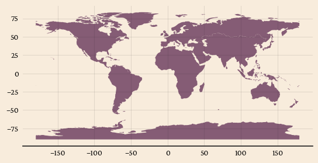

Si vous souhaitez obtenir la limite d’un seul continent, il vous suffit
de passer son nom en paramètre. Dans l’exemple ci-dessous, on récupère
la limite de l’Afrique.

``` python
africa=bound.continents("africa")
africa.plot()
```

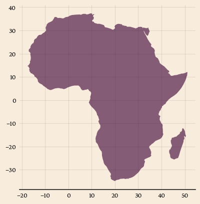

Si vous souhaitez obtenir la limite de plusieurs continents, il vous
suffit de passer leur liste en paramètre. Dans l’exemple ci-dessous, on
récupère la limite de l’Afrique et de l’Asie.

``` python
africa_asia=bound.continents(["africa","asia"])
africa_asia.plot()
```

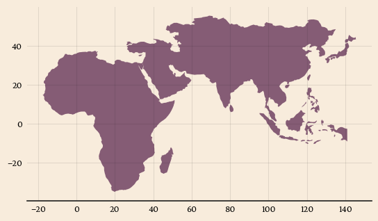

#### **Telecharger les limites administratifs de pays**

Pour télécharger les données des limites administratives d’un pays, vous
aurez besoin de deux paramètres importants : le nom du pays et le niveau
de subdivision administrative souhaité (`adminlevel`).

**Les noms de pays et code iso :**

Les codes des pays sont conformes à la norme ISO 3166-1 alpha-3. Pour
obtenir la liste des pays valides, vous pouvez utiliser la méthode
`list_countries()` de l’objet `GeoBoundaries`. L’exemple si dessous
renvoi la liste des 10 premiers noms pays.

``` python
# Affiche les 10 premiers pays
bound.list_countries()[0:10]
```

    ['أفغانستان',
     'афганистан',
     'afghánistán',
     'afghanistan',
     'αφγανιστάν',
     'afganio',
     'afganistán',
     'afganistan',
     'afganisztán',
     'աֆղանստան']

Vous pouvez également rechercher le code ISO d’un pays en utilisant la
méthode `get_iso3`. Dans l’exemple suivant, on essaye d’obtenir le code
ISO de tous les pays contenant le mot-clé « burk ». La méthode renvoie
le code ISO3 du Burkina Faso, car c’est le seul pays trouvé.

``` python
# Pour obtenir le code iso de tous les pays du monde contenant le mot clé "burk"
bound.get_iso3("burk")
```

    'BFA'

Si plusieurs pays correspondent, elle retourne une liste de tuples (nom
du pays, code ISO3).

``` python
bound.get_iso3("con")  # Exemple pour obtenir le code ISO d'un pays
```

    [('congo', 'cog'),
     ('república del congo', 'cog'),
     ('république du congo', 'cog'),
     ('rep. del congo', 'cog'),
     ('congo-brazzaville', 'cog'),
     ('república do congo', 'cog'),
     ('demokratiske republik congo', 'cod'),
     ('congo, democratic republic of the', 'cod'),
     ('república democrática del congo', 'cod'),
     ('république démocratique du congo', 'cod'),
     ('rd del congo', 'cod'),
     ('congo-kinshasa', 'cod'),
     ('república democrática do congo', 'cod'),
     ('republica democrată congo', 'cod')]

**Les niveaux de subdivisions administratives d’un pays :**

Il existe *cinq (5)* niveaux de subdivisions administratives
disponibles. Pour les afficher, utilisez la méthode `admLevels` comme
suit :

``` python
print(bound.adminLevels())
```


    | Niveau GeoBoundaries | Nom commun (FR)           | Nom commun (EN)       |
    | -------------------- | ------------------------- | --------------------- |
    | ADM0                 | Pays                      | Country               |
    | ADM1                 | Région / État / Province  | State / Region        |
    | ADM2                 | Département / District    | District / County     |
    | ADM3                 | Sous-préfecture / Commune | Subdistrict / Commune |
    | ADM4                 | Village / Localité        | Village / Locality    |
    | ADM5                 | Quartier / Secteur        | Neighborhood / Sector |
            

> \[!NOTE\]
>
> -   Le nombre de niveaux dépend du pays. Certains pays s’arrêtent à
>     ADM2, d’autres vont jusqu’à ADM4 ou ADM5.
> -   Le nom réel des subdivisions varie d’un pays à l’autre (ex. :
>     « State », « Region », « Province », « Department », etc.).
> -   GeoBoundaries propose toujours au moins le niveau ADM0 (frontière
>     nationale).

Pour savoir si un niveau administratif est disponible pour un pays, vous
pouvez utiliser la méthode `is_valid_adm` de l’objet `GeoBoundaries`.
Voici un exemple :

``` python
# Exemple pour vérifier si le niveau ADM1 est valide pour la Côte d'Ivoire
print(bound.is_valid_adm("CIV","ADM1"))
```

    True

``` python
# Exemple pour vérifier le niveau admin minimum pour la Côte d'Ivoire
print(bound._get_smallest_adm("CIV")) 
```

    Smallest ADM level found for CIV : ADM3
    ADM3

Lorsque vous avez le nom d’un ou de plusieurs pays ainsi qu’un niveau de
subdivision administrative, vous pouvez alors télécharger les données.

**Télécharger les données administratives d’un pays:**

``` python

# Exemple : Récupérer les données administratives des régions de la cote d'ivoire
civ_data = bound.adm("CIV", "ADM2")
civ_data.head()
```

<div>
<style scoped>
    .dataframe tbody tr th:only-of-type {
        vertical-align: middle;
    }

    .dataframe tbody tr th {
        vertical-align: top;
    }

    .dataframe thead th {
        text-align: right;
    }
</style>

<table class="dataframe" data-quarto-postprocess="true" data-border="1">
<thead>
<tr style="text-align: right;">
<th data-quarto-table-cell-role="th"></th>
<th data-quarto-table-cell-role="th">geometry</th>
<th data-quarto-table-cell-role="th">shapeName</th>
<th data-quarto-table-cell-role="th">shapeISO</th>
<th data-quarto-table-cell-role="th">shapeID</th>
<th data-quarto-table-cell-role="th">shapeGroup</th>
<th data-quarto-table-cell-role="th">shapeType</th>
</tr>
</thead>
<tbody>
<tr>
<td data-quarto-table-cell-role="th">0</td>
<td>POLYGON ((-4.68451 6.27179, -4.6868 6.26883, -...</td>
<td>Agneby-Tiassa</td>
<td></td>
<td>98640826B52449815511854</td>
<td>CIV</td>
<td>ADM2</td>
</tr>
<tr>
<td data-quarto-table-cell-role="th">1</td>
<td>POLYGON ((-7.71925 9.07004, -7.72574 9.06397, ...</td>
<td>Bafing</td>
<td></td>
<td>98640826B37750272367318</td>
<td>CIV</td>
<td>ADM2</td>
</tr>
<tr>
<td data-quarto-table-cell-role="th">2</td>
<td>POLYGON ((-6.19702 10.24246, -6.20038 10.24495...</td>
<td>Bagoue</td>
<td></td>
<td>98640826B26044148659027</td>
<td>CIV</td>
<td>ADM2</td>
</tr>
<tr>
<td data-quarto-table-cell-role="th">3</td>
<td>MULTIPOLYGON (((-4.68451 6.27179, -4.68338 6.2...</td>
<td>Belier</td>
<td></td>
<td>98640826B5123145245776</td>
<td>CIV</td>
<td>ADM2</td>
</tr>
<tr>
<td data-quarto-table-cell-role="th">4</td>
<td>POLYGON ((-6.70042 9.06196, -6.70118 9.05639, ...</td>
<td>Bere</td>
<td></td>
<td>98640826B43857880322183</td>
<td>CIV</td>
<td>ADM2</td>
</tr>
</tbody>
</table>

</div>

``` python
civ_data.plot()
```

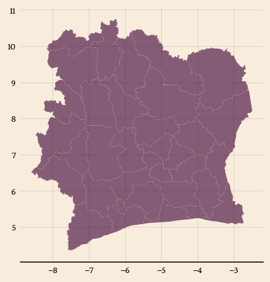

**Télécharger les données administratives de plusieurs pays:**

Assurez-vous que le niveau administratif (`adminLevel`) est bien
disponible pour tous les pays présents dans la liste à télécharger.

``` python
# Exemple : Récupérer les limites administratives de plusieurs pays (senegal et mali ici)
countries_data = bound.adm(["SEN", "mali"], "ADM2")
countries_data["mali"].head()
```

<div>
<style scoped>
    .dataframe tbody tr th:only-of-type {
        vertical-align: middle;
    }

    .dataframe tbody tr th {
        vertical-align: top;
    }

    .dataframe thead th {
        text-align: right;
    }
</style>

<table class="dataframe" data-quarto-postprocess="true" data-border="1">
<thead>
<tr style="text-align: right;">
<th data-quarto-table-cell-role="th"></th>
<th data-quarto-table-cell-role="th">geometry</th>
<th data-quarto-table-cell-role="th">shapeName</th>
<th data-quarto-table-cell-role="th">shapeISO</th>
<th data-quarto-table-cell-role="th">shapeID</th>
<th data-quarto-table-cell-role="th">shapeGroup</th>
<th data-quarto-table-cell-role="th">shapeType</th>
</tr>
</thead>
<tbody>
<tr>
<td data-quarto-table-cell-role="th">0</td>
<td>POLYGON ((-7.92938 12.68171, -7.93554 12.68821...</td>
<td>Bamako</td>
<td></td>
<td>8926073B70420899930674</td>
<td>MLI</td>
<td>ADM2</td>
</tr>
<tr>
<td data-quarto-table-cell-role="th">1</td>
<td>POLYGON ((1.32448 16.90639, 1.03227 16.61402, ...</td>
<td>Ansongo</td>
<td></td>
<td>8926073B56917716124995</td>
<td>MLI</td>
<td>ADM2</td>
</tr>
<tr>
<td data-quarto-table-cell-role="th">2</td>
<td>POLYGON ((1.17767 17.69958, 1.15458 17.70648, ...</td>
<td>Bourem</td>
<td></td>
<td>8926073B86504284097699</td>
<td>MLI</td>
<td>ADM2</td>
</tr>
<tr>
<td data-quarto-table-cell-role="th">3</td>
<td>POLYGON ((1.32448 16.90639, 1.65353 17.5735, 1...</td>
<td>Gao</td>
<td></td>
<td>8926073B84061132695750</td>
<td>MLI</td>
<td>ADM2</td>
</tr>
<tr>
<td data-quarto-table-cell-role="th">4</td>
<td>POLYGON ((1.31144 15.27381, 1.4716 15.28167, 1...</td>
<td>Menaka</td>
<td></td>
<td>8926073B3742503303790</td>
<td>MLI</td>
<td>ADM2</td>
</tr>
</tbody>
</table>

</div>

#### **Récupérer les métadonnées d’un territoire**

Pour aller plus loin que la simple récupération des limites
géographiques, vous pouvez également obtenir des informations
descriptives sur un territoire grâce à la méthode `metadata`. Par
exemple, le code ci-dessous permet de récupérer les métadonnées
associées au niveau national (`ADM0`) de la Côte d’Ivoire, en utilisant
son code ISO (`CIV`). Vous pouvez ensuite explorer les différentes
informations disponibles, comme le nom du territoire, sa superficie, son
code ISO, la source des données, etc.

``` python

# Récupérer les métadonnées disponibles pour la Côte d'Ivoire
metadata_civ = bound.metadata("CIV", "ADM0")

print(list(metadata_civ.keys()))
```

    ['boundaryID', 'boundaryName', 'boundaryISO', 'boundaryYearRepresented', 'boundaryType', 'boundaryCanonical', 'boundarySource', 'boundaryLicense', 'licenseDetail', 'licenseSource', 'boundarySourceURL', 'sourceDataUpdateDate', 'buildDate', 'Continent', 'UNSDG-region', 'UNSDG-subregion', 'worldBankIncomeGroup', 'admUnitCount', 'meanVertices', 'minVertices', 'maxVertices', 'meanPerimeterLengthKM', 'minPerimeterLengthKM', 'maxPerimeterLengthKM', 'meanAreaSqKM', 'minAreaSqKM', 'maxAreaSqKM', 'staticDownloadLink', 'gjDownloadURL', 'tjDownloadURL', 'imagePreview', 'simplifiedGeometryGeoJSON']

``` python
# Le continent
metadata_civ["Continent"]
```

    'Africa'

``` python
# Sous région
metadata_civ["UNSDG-subregion"]
```

    'Western Africa'

``` python
# Région 
metadata_civ["UNSDG-region"]
```

    'Sub-Saharan Africa'

``` python
# Url de la prévisualisation de la carte du pays
url_img=metadata_civ["imagePreview"]
url_img
```

    'https://github.com/wmgeolab/geoBoundaries/raw/9469f09/releaseData/gbOpen/CIV/ADM0/geoBoundaries-CIV-ADM0-PREVIEW.png'

``` python
# Afficher l'image de prévisualisation dans le notebook
from IPython.display import Image, display

try :
    display(Image(url=url_img))
except :
    print("Impossible d'afficher l'image.")
```


### **Géocoder une ou plusieurs adresses**

Le géocodage permet de convertir des adresses en coordonnées
géographiques (latitude et longitude). Vous pouvez géocoder une ou
plusieurs adresses en utilisant les méthodes `geocode` et
`reverse_geocode` de l’objet `Geocoder`.

Commencez par creer un objet Geocoder :

``` python
from cartograpy import data
geocoder= data.Geocoder()
```

Vous pouvez maintenant géocoder une ou plusieurs adresses.

#### **Géocodage**

La méthode `geocode` renvoie un tuple dont la première position est un
GeoDataFrame des adresses trouvées, et la deuxième une liste des
adresses non trouvées. Si une adresse n’est pas trouvée, elle est
simplement ignorée.

Le géocodage peut également être effectué sur plusieurs adresses à la
fois, en passant une liste d’adresses en paramètre.

**Géocoder une adresse**

``` python
addresse = "bouaké"
resultat_geocode = geocoder.geocode(addresse)

# Adresse trouvée
resultat_geocode[0]
```

    Début du géocodage de 1 localité(s)...
    Géocodage terminé.

<div>
<style scoped>
    .dataframe tbody tr th:only-of-type {
        vertical-align: middle;
    }

    .dataframe tbody tr th {
        vertical-align: top;
    }

    .dataframe thead th {
        text-align: right;
    }
</style>

<table class="dataframe" data-quarto-postprocess="true" data-border="1">
<thead>
<tr style="text-align: right;">
<th data-quarto-table-cell-role="th"></th>
<th data-quarto-table-cell-role="th">query</th>
<th data-quarto-table-cell-role="th">address</th>
<th data-quarto-table-cell-role="th">latitude</th>
<th data-quarto-table-cell-role="th">longitude</th>
<th data-quarto-table-cell-role="th">altitude</th>
<th data-quarto-table-cell-role="th">raw</th>
<th data-quarto-table-cell-role="th">geometry</th>
</tr>
</thead>
<tbody>
<tr>
<td data-quarto-table-cell-role="th">0</td>
<td>bouaké</td>
<td>Bouaké, Gbêkê, Vallée du Bandama, Côte d’Ivoire</td>
<td>7.689021</td>
<td>-5.028355</td>
<td>0.0</td>
<td>{'place_id': 275820936, 'licence': 'Data © Ope...</td>
<td>POINT (-5.02836 7.68902)</td>
</tr>
</tbody>
</table>

</div>

``` python
# Adresse non trouvée
resultat_geocode[1]
```

    []

**Geocoder une liste d’adresses**

``` python
liste_adresses = ["Abidjan", "Yamoussoukro", "Bouaké", "Korhogo","Man CI", "","portbouet"]
resultat_geocode=geocoder.geocode(liste_adresses)

# Adresses trouvées
resultat_geocode[0]
```

    Début du géocodage de 7 localité(s)...
    Géocodage terminé.

<div>
<style scoped>
    .dataframe tbody tr th:only-of-type {
        vertical-align: middle;
    }

    .dataframe tbody tr th {
        vertical-align: top;
    }

    .dataframe thead th {
        text-align: right;
    }
</style>

<table class="dataframe" data-quarto-postprocess="true" data-border="1">
<thead>
<tr style="text-align: right;">
<th data-quarto-table-cell-role="th"></th>
<th data-quarto-table-cell-role="th">query</th>
<th data-quarto-table-cell-role="th">address</th>
<th data-quarto-table-cell-role="th">latitude</th>
<th data-quarto-table-cell-role="th">longitude</th>
<th data-quarto-table-cell-role="th">altitude</th>
<th data-quarto-table-cell-role="th">raw</th>
<th data-quarto-table-cell-role="th">geometry</th>
</tr>
</thead>
<tbody>
<tr>
<td data-quarto-table-cell-role="th">0</td>
<td>Abidjan</td>
<td>Abidjan, Côte d’Ivoire</td>
<td>5.320357</td>
<td>-4.016107</td>
<td>0.0</td>
<td>{'place_id': 275930228, 'licence': 'Data © Ope...</td>
<td>POINT (-4.01611 5.32036)</td>
</tr>
<tr>
<td data-quarto-table-cell-role="th">1</td>
<td>Yamoussoukro</td>
<td>Yamoussoukro, Côte d’Ivoire</td>
<td>6.820007</td>
<td>-5.277603</td>
<td>0.0</td>
<td>{'place_id': 405334522, 'licence': 'Data © Ope...</td>
<td>POINT (-5.2776 6.82001)</td>
</tr>
<tr>
<td data-quarto-table-cell-role="th">2</td>
<td>Bouaké</td>
<td>Bouaké, Gbêkê, Vallée du Bandama, Côte d’Ivoire</td>
<td>7.689021</td>
<td>-5.028355</td>
<td>0.0</td>
<td>{'place_id': 275820936, 'licence': 'Data © Ope...</td>
<td>POINT (-5.02836 7.68902)</td>
</tr>
<tr>
<td data-quarto-table-cell-role="th">3</td>
<td>Korhogo</td>
<td>Korhogo, Poro, Savanes, Côte d’Ivoire</td>
<td>9.458070</td>
<td>-5.631629</td>
<td>0.0</td>
<td>{'place_id': 276083703, 'licence': 'Data © Ope...</td>
<td>POINT (-5.63163 9.45807)</td>
</tr>
<tr>
<td data-quarto-table-cell-role="th">4</td>
<td>Man CI</td>
<td>Man, Tonkpi, Montagnes, Côte d’Ivoire</td>
<td>7.410258</td>
<td>-7.550372</td>
<td>0.0</td>
<td>{'place_id': 277270784, 'licence': 'Data © Ope...</td>
<td>POINT (-7.55037 7.41026)</td>
</tr>
</tbody>
</table>

</div>

``` python
# Adresses non trouvée
resultat_geocode[1]
```

    ['', 'portbouet']

> \[!NOTE\]
>
> **Notez qu’une adresse peut ne pas être trouvé du fait de la connexion
> internet dans ce cas relancez la commande**

#### **Reverse géocodage**

Le reverse géocodage, ou géocodage inversé, consiste à convertir des
coordonnées géographiques (latitude et longitude) en une adresse ou un
lieu compréhensible par l’humain. Cette opération est particulièrement
utile lorsqu’on dispose d’un point sur une carte et qu’on souhaite
obtenir l’adresse correspondante, comme le nom de la rue, la ville ou
même des points d’intérêt à proximité. Le module `Geocoder` de
cartograpy propose une méthode dédiée pour effectuer facilement ce type
de requête à partir d’une ou plusieurs coordonnées. Il s’agit de la
méthode `reverse_geocode` et retourne la même chose que `geocode`.

``` python
resultats_reverse=geocoder.reverse_geocode((48.8566, 2.3522))
```

    Début du géocodage inverse (coordonnées -> adresse) de 1 point(s)...
    Géocodage inverse (coordonnées -> adresse) terminé.

``` python
# trouvé
resultats_reverse[0]
# On a ici les résulats de l'hotel de ville de Paris
```

<div>
<style scoped>
    .dataframe tbody tr th:only-of-type {
        vertical-align: middle;
    }

    .dataframe tbody tr th {
        vertical-align: top;
    }

    .dataframe thead th {
        text-align: right;
    }
</style>

<table class="dataframe" data-quarto-postprocess="true" data-border="1">
<thead>
<tr style="text-align: right;">
<th data-quarto-table-cell-role="th"></th>
<th data-quarto-table-cell-role="th">query</th>
<th data-quarto-table-cell-role="th">address</th>
<th data-quarto-table-cell-role="th">latitude</th>
<th data-quarto-table-cell-role="th">longitude</th>
<th data-quarto-table-cell-role="th">altitude</th>
<th data-quarto-table-cell-role="th">raw</th>
<th data-quarto-table-cell-role="th">geometry</th>
</tr>
</thead>
<tbody>
<tr>
<td data-quarto-table-cell-role="th">0</td>
<td>48.8566, 2.3522</td>
<td>Hôtel de Ville, Place de l'Hôtel de Ville, Qua...</td>
<td>48.856426</td>
<td>2.352528</td>
<td>0.0</td>
<td>{'place_id': 88107043, 'licence': 'Data © Open...</td>
<td>POINT (2.35253 48.85643)</td>
</tr>
</tbody>
</table>

</div>

``` python
# Pas trouvé 
resultats_reverse[1]
```

    []

### **Télécharger des données hyrographiques**

La classe `Hydro` de cartograpy.data permet de télécharger facilement
les données de réseaux hydrographiques à l’échelle des continents, en
s’appuyant sur la base de données internationale **HydroRivers**. Grâce
à cette classe, vous pouvez accéder rapidement aux principaux cours
d’eau et réseaux hydrologiques d’un continent donné, ce qui facilite la
création de cartes thématiques, l’analyse des bassins versants ou
l’étude des ressources en eau à large échelle.

Vous pouvez commencer par créer un objet `Hydro`.

``` python
from cartograpy import data
hydro=data.Hydro()
```

#### **Informations sur les variables disponibles**

Pour obtenir des informations sur les différentes variables de la
GeoDataFrame d’hydrorivers retournée, vous pouvez utiliser la méthode
`describe_variables()` de `Hydro`.

``` python
print(hydro.describe_variables())
```


        📘 Description des variables HydroRIVERS :
    | Nom          | Signification                    | Unité / Type         |
    | ------------ | -------------------------------- | -------------------- |
    | `HYRIV_ID`   | ID du tronçon                    | entier               |
    | `NEXT_DOWN`  | ID du tronçon aval               | entier               |
    | `MAIN_RIV`   | ID du fleuve principal           | entier               |
    | `LENGTH_KM`  | Longueur du segment              | km (float)           |
    | `DIST_DN_KM` | Distance jusqu'à l'embouchure    | km (float)           |
    | `DIST_UP_KM` | Distance depuis la source        | km (float)           |
    | `CATCH_SKM`  | Surface locale du bassin versant | km² (float)          |
    | `UPLAND_SKM` | Surface totale en amont          | km² (float)          |
    | `ENDORHEIC`  | 1 = bassin fermé, 0 = ouvert     | booléen (int)        |
    | `DIS_AV_CMS` | Débit moyen                      | m³/s (float)         |
    | `ORD_STRA`   | Ordre de Strahler                | entier               |
    | `ORD_CLAS`   | Classe hiérarchique simplifiée   | entier               |
    | `ORD_FLOW`   | Ordre de flux                    | entier               |
    | `HYBAS_L12`  | Code du bassin de niveau 12      | entier (catégorique) |
      

#### **Télécharger les données de réseau hydrographique**

Pour ce faire, vous devez utiliser la méthode `download` de `Hydro` et
lui passer le code de la région (continent) en paramètre.

**Liste des régions:**

``` python
hydro.valid_regions
```

    ['af', 'as', 'au', 'eu', 'na', 'sa']

<table>
<thead>
<tr>
<th>Code</th>
<th>Région</th>
</tr>
</thead>
<tbody>
<tr>
<td>af</td>
<td>Afrique</td>
</tr>
<tr>
<td>as</td>
<td>Asie</td>
</tr>
<tr>
<td>au</td>
<td>Australie/Océanie</td>
</tr>
<tr>
<td>eu</td>
<td>Europe</td>
</tr>
<tr>
<td>na</td>
<td>Amérique du Nord</td>
</tr>
<tr>
<td>sa</td>
<td>Amérique du Sud</td>
</tr>
</tbody>
</table>

**Téléchargement des données**

``` python
rivers_africa = hydro.download(region="af")  # Afrique
rivers_africa.head()
```

    Les données pour la région AF sont déjà présentes.

<div>
<style scoped>
    .dataframe tbody tr th:only-of-type {
        vertical-align: middle;
    }

    .dataframe tbody tr th {
        vertical-align: top;
    }

    .dataframe thead th {
        text-align: right;
    }
</style>

<table class="dataframe" data-quarto-postprocess="true" data-border="1">
<thead>
<tr style="text-align: right;">
<th data-quarto-table-cell-role="th"></th>
<th data-quarto-table-cell-role="th">HYRIV_ID</th>
<th data-quarto-table-cell-role="th">NEXT_DOWN</th>
<th data-quarto-table-cell-role="th">MAIN_RIV</th>
<th data-quarto-table-cell-role="th">LENGTH_KM</th>
<th data-quarto-table-cell-role="th">DIST_DN_KM</th>
<th data-quarto-table-cell-role="th">DIST_UP_KM</th>
<th data-quarto-table-cell-role="th">CATCH_SKM</th>
<th data-quarto-table-cell-role="th">UPLAND_SKM</th>
<th data-quarto-table-cell-role="th">ENDORHEIC</th>
<th data-quarto-table-cell-role="th">DIS_AV_CMS</th>
<th data-quarto-table-cell-role="th">ORD_STRA</th>
<th data-quarto-table-cell-role="th">ORD_CLAS</th>
<th data-quarto-table-cell-role="th">ORD_FLOW</th>
<th data-quarto-table-cell-role="th">HYBAS_L12</th>
<th data-quarto-table-cell-role="th">geometry</th>
</tr>
</thead>
<tbody>
<tr>
<td data-quarto-table-cell-role="th">0</td>
<td>10000001</td>
<td>0</td>
<td>10000001</td>
<td>0.89</td>
<td>0.0</td>
<td>7.2</td>
<td>11.27</td>
<td>11.1</td>
<td>0</td>
<td>0.062</td>
<td>1</td>
<td>1</td>
<td>8</td>
<td>1120031210</td>
<td>LINESTRING (9.6625 37.325, 9.65625 37.33125)</td>
</tr>
<tr>
<td data-quarto-table-cell-role="th">1</td>
<td>10000002</td>
<td>0</td>
<td>10000002</td>
<td>2.90</td>
<td>0.0</td>
<td>7.0</td>
<td>24.59</td>
<td>24.2</td>
<td>0</td>
<td>0.126</td>
<td>1</td>
<td>1</td>
<td>7</td>
<td>1120031210</td>
<td>LINESTRING (9.8 37.30833, 9.81042 37.31875, 9....</td>
</tr>
<tr>
<td data-quarto-table-cell-role="th">2</td>
<td>10000003</td>
<td>10000009</td>
<td>10000009</td>
<td>4.63</td>
<td>5.7</td>
<td>9.8</td>
<td>57.23</td>
<td>57.2</td>
<td>0</td>
<td>0.316</td>
<td>1</td>
<td>1</td>
<td>7</td>
<td>1120031210</td>
<td>LINESTRING (9.68542 37.27083, 9.68542 37.26458...</td>
</tr>
<tr>
<td data-quarto-table-cell-role="th">3</td>
<td>10000004</td>
<td>10000009</td>
<td>10000009</td>
<td>0.69</td>
<td>5.7</td>
<td>5.4</td>
<td>11.11</td>
<td>11.1</td>
<td>0</td>
<td>0.061</td>
<td>1</td>
<td>2</td>
<td>8</td>
<td>1120031210</td>
<td>LINESTRING (9.71458 37.2375, 9.71458 37.24375)</td>
</tr>
<tr>
<td data-quarto-table-cell-role="th">4</td>
<td>10000005</td>
<td>0</td>
<td>10000005</td>
<td>8.32</td>
<td>0.0</td>
<td>13.6</td>
<td>35.02</td>
<td>34.0</td>
<td>0</td>
<td>0.177</td>
<td>1</td>
<td>1</td>
<td>7</td>
<td>1120031210</td>
<td>LINESTRING (9.75 37.27708, 9.75625 37.27708, 9...</td>
</tr>
</tbody>
</table>

</div>

``` python
rivers_africa.plot()
```

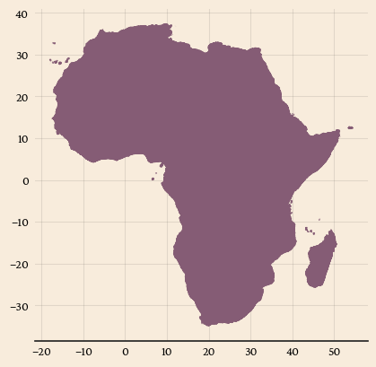

### **Télécharger données de OpenStreeMap**

**OpenStreetMap (OSM)** est une base de données cartographique mondiale,
collaborative et libre, qui recense de nombreux objets géographiques
(routes, bâtiments, points d’intérêt, etc.) à l’échelle mondiale.

La classe `OSM` du module `data` de cartograpy offre une interface
simple et puissante pour télécharger des données issues d’OpenStreetMap
(OSM) selon une grande variété de besoins.

Pour commencer, creez un objet `OSM`.

``` python
from cartograpy import data
osm = data.OSM()
```

#### **Gérer et explorer les tags OSM**

La classe `OSM` fournit plusieurs méthodes pour faciliter la recherche
et la compréhension des tags OSM, qui définissent le type d’objets
géographiques à télécharger (bâtiments, routes, écoles, hôpitaux, etc.).
Ces outils facilitent la préparation des filtres à appliquer pour
récupérer les données OSM qui correspondent à votre projet.

-   **`list_tags`** permet d’obtenir la liste des tags par grande
    famille (bâtiment, voirie, loisirs, etc.) :

``` python
print(osm.list_tags('amenity'))  # Affiche les tags liés aux services publics
```

    ['amenity']

-   **`search_tags`** permet de rechercher un mot-clé dans tous les tags
    pour trouver rapidement ce qui vous intéresse :

``` python
print(osm.search_tags('hospital'))  # Recherche tous les tags relatifs aux hôpitaux
```

    {'building': {'description': 'Bâtiments et structures', 'matching_tags': {'building': ['hospital']}, 'example': {'building': 'house', 'building:levels': '2'}}, 'amenity': {'description': 'Services publics et commodités', 'matching_tags': {'amenity': ['hospital']}, 'example': {'amenity': 'restaurant', 'cuisine': 'french'}}}

-   **`get_common_tag_combinations`** retourne des exemples de requêtes
    toutes prêtes pour les objets OSM les plus fréquents :

``` python
print(osm.get_common_tag_combinations()['restaurants'])
```

    {'amenity': 'restaurant'}

#### **Télécharger les données OSM**

Une fois les tags identifiés, la méthode `get_data` vous permet de
télécharger les objets OSM d’intérêt pour une zone donnée, sous forme de
GeoDataFrame.

Il suffit de spécifier les tags OSM correspondant au type d’objet
recherché (bâtiments, routes, écoles, hôpitaux, etc.) ainsi que le type
de géométrie souhaité (points, polygons, lines ou all).

-   Vous pouvez utiliser un **nom de lieu** :

``` python
 # Exemple : télécharger toutes les écoles à Abidjan
schools = osm.get_data("Abidjan, Côte d'Ivoire", {"amenity": "school"}, data_type="points")
schools.head()
```

<div>
<style scoped>
    .dataframe tbody tr th:only-of-type {
        vertical-align: middle;
    }

    .dataframe tbody tr th {
        vertical-align: top;
    }

    .dataframe thead th {
        text-align: right;
    }
</style>

<table class="dataframe" data-quarto-postprocess="true" data-border="1">
<thead>
<tr style="text-align: right;">
<th data-quarto-table-cell-role="th"></th>
<th data-quarto-table-cell-role="th"></th>
<th data-quarto-table-cell-role="th">geometry</th>
<th data-quarto-table-cell-role="th">amenity</th>
<th data-quarto-table-cell-role="th">name</th>
<th data-quarto-table-cell-role="th">addr:city</th>
<th data-quarto-table-cell-role="th">addr:country</th>
<th data-quarto-table-cell-role="th">addr:state</th>
<th data-quarto-table-cell-role="th">addr:street</th>
<th data-quarto-table-cell-role="th">source</th>
<th data-quarto-table-cell-role="th">toilets:wheelchair</th>
<th data-quarto-table-cell-role="th">operator</th>
<th data-quarto-table-cell-role="th">...</th>
<th data-quarto-table-cell-role="th">addr:postbox</th>
<th data-quarto-table-cell-role="th">capacity</th>
<th data-quarto-table-cell-role="th">max_age</th>
<th data-quarto-table-cell-role="th">min_age</th>
<th data-quarto-table-cell-role="th">addr:full</th>
<th data-quarto-table-cell-role="th">fax</th>
<th data-quarto-table-cell-role="th">addr:pobox</th>
<th data-quarto-table-cell-role="th">height</th>
<th data-quarto-table-cell-role="th">start_date</th>
<th data-quarto-table-cell-role="th">type</th>
</tr>
<tr>
<th data-quarto-table-cell-role="th">element</th>
<th data-quarto-table-cell-role="th">id</th>
<th data-quarto-table-cell-role="th"></th>
<th data-quarto-table-cell-role="th"></th>
<th data-quarto-table-cell-role="th"></th>
<th data-quarto-table-cell-role="th"></th>
<th data-quarto-table-cell-role="th"></th>
<th data-quarto-table-cell-role="th"></th>
<th data-quarto-table-cell-role="th"></th>
<th data-quarto-table-cell-role="th"></th>
<th data-quarto-table-cell-role="th"></th>
<th data-quarto-table-cell-role="th"></th>
<th data-quarto-table-cell-role="th"></th>
<th data-quarto-table-cell-role="th"></th>
<th data-quarto-table-cell-role="th"></th>
<th data-quarto-table-cell-role="th"></th>
<th data-quarto-table-cell-role="th"></th>
<th data-quarto-table-cell-role="th"></th>
<th data-quarto-table-cell-role="th"></th>
<th data-quarto-table-cell-role="th"></th>
<th data-quarto-table-cell-role="th"></th>
<th data-quarto-table-cell-role="th"></th>
<th data-quarto-table-cell-role="th"></th>
</tr>
</thead>
<tbody>
<tr>
<td rowspan="5" data-quarto-table-cell-role="th"
data-valign="top">node</td>
<td data-quarto-table-cell-role="th">452872059</td>
<td>POINT (-3.96766 5.35476)</td>
<td>school</td>
<td>Le Phénix</td>
<td>NaN</td>
<td>NaN</td>
<td>NaN</td>
<td>NaN</td>
<td>NaN</td>
<td>NaN</td>
<td>NaN</td>
<td>...</td>
<td>NaN</td>
<td>NaN</td>
<td>NaN</td>
<td>NaN</td>
<td>NaN</td>
<td>NaN</td>
<td>NaN</td>
<td>NaN</td>
<td>NaN</td>
<td>NaN</td>
</tr>
<tr>
<td data-quarto-table-cell-role="th">768587329</td>
<td>POINT (-4.08861 5.31753)</td>
<td>school</td>
<td>Collège Gloris</td>
<td>NaN</td>
<td>NaN</td>
<td>NaN</td>
<td>NaN</td>
<td>NaN</td>
<td>NaN</td>
<td>NaN</td>
<td>...</td>
<td>NaN</td>
<td>NaN</td>
<td>NaN</td>
<td>NaN</td>
<td>NaN</td>
<td>NaN</td>
<td>NaN</td>
<td>NaN</td>
<td>NaN</td>
<td>NaN</td>
</tr>
<tr>
<td data-quarto-table-cell-role="th">768587517</td>
<td>POINT (-4.07367 5.33721)</td>
<td>school</td>
<td>Institut Nelson Mandela Yop</td>
<td>Yopougon</td>
<td>CI</td>
<td>Abidjan</td>
<td>Rue O13</td>
<td>NaN</td>
<td>NaN</td>
<td>NaN</td>
<td>...</td>
<td>NaN</td>
<td>NaN</td>
<td>NaN</td>
<td>NaN</td>
<td>NaN</td>
<td>NaN</td>
<td>NaN</td>
<td>NaN</td>
<td>NaN</td>
<td>NaN</td>
</tr>
<tr>
<td data-quarto-table-cell-role="th">775786986</td>
<td>POINT (-3.95377 5.35125)</td>
<td>school</td>
<td>École maternelle</td>
<td>NaN</td>
<td>NaN</td>
<td>NaN</td>
<td>NaN</td>
<td>NaN</td>
<td>NaN</td>
<td>NaN</td>
<td>...</td>
<td>NaN</td>
<td>NaN</td>
<td>NaN</td>
<td>NaN</td>
<td>NaN</td>
<td>NaN</td>
<td>NaN</td>
<td>NaN</td>
<td>NaN</td>
<td>NaN</td>
</tr>
<tr>
<td data-quarto-table-cell-role="th">844756679</td>
<td>POINT (-3.99363 5.30375)</td>
<td>school</td>
<td>Collège Voltaire</td>
<td>Marcory</td>
<td>CI</td>
<td>Abidjan</td>
<td>NaN</td>
<td>NaN</td>
<td>NaN</td>
<td>NaN</td>
<td>...</td>
<td>NaN</td>
<td>NaN</td>
<td>NaN</td>
<td>NaN</td>
<td>NaN</td>
<td>NaN</td>
<td>NaN</td>
<td>NaN</td>
<td>NaN</td>
<td>NaN</td>
</tr>
</tbody>
</table>

<p>5 rows × 64 columns</p>
</div>

-   Ou une **bounding box** :

``` python
  # Télécharger tous les routets dans une zone définie par une bbox
import osmnx as ox
# Coordonnées approximatives du centre de Yamoussoukro
center = (6.8206, -5.2767)
# Distance en mètres au tour du centre de la ville
bbox = ox.utils_geo.bbox_from_point(center, dist=10000)

tags = {"highway": ["motorway", "trunk", "primary", "secondary", "tertiary", "residential", "footway", "cycleway"]} # Pour les routes
highway = osm.get_data(bbox, tags, data_type="lines")
highway.head()
```

<div>
<style scoped>
    .dataframe tbody tr th:only-of-type {
        vertical-align: middle;
    }

    .dataframe tbody tr th {
        vertical-align: top;
    }

    .dataframe thead th {
        text-align: right;
    }
</style>

<table class="dataframe" data-quarto-postprocess="true" data-border="1">
<thead>
<tr style="text-align: right;">
<th data-quarto-table-cell-role="th"></th>
<th data-quarto-table-cell-role="th"></th>
<th data-quarto-table-cell-role="th">geometry</th>
<th data-quarto-table-cell-role="th">crossing</th>
<th data-quarto-table-cell-role="th">highway</th>
<th data-quarto-table-cell-role="th">name</th>
<th data-quarto-table-cell-role="th">maxspeed</th>
<th data-quarto-table-cell-role="th">surface</th>
<th data-quarto-table-cell-role="th">lanes</th>
<th data-quarto-table-cell-role="th">smoothness</th>
<th data-quarto-table-cell-role="th">source</th>
<th data-quarto-table-cell-role="th">noname</th>
<th data-quarto-table-cell-role="th">...</th>
<th data-quarto-table-cell-role="th">kerb</th>
<th data-quarto-table-cell-role="th">tactile_paving</th>
<th data-quarto-table-cell-role="th">mtb:scale</th>
<th data-quarto-table-cell-role="th">bridge</th>
<th data-quarto-table-cell-role="th">layer</th>
<th data-quarto-table-cell-role="th">shoulder</th>
<th data-quarto-table-cell-role="th">toll</th>
<th data-quarto-table-cell-role="th">turn:lanes</th>
<th data-quarto-table-cell-role="th">description</th>
<th data-quarto-table-cell-role="th">leisure</th>
</tr>
<tr>
<th data-quarto-table-cell-role="th">element</th>
<th data-quarto-table-cell-role="th">id</th>
<th data-quarto-table-cell-role="th"></th>
<th data-quarto-table-cell-role="th"></th>
<th data-quarto-table-cell-role="th"></th>
<th data-quarto-table-cell-role="th"></th>
<th data-quarto-table-cell-role="th"></th>
<th data-quarto-table-cell-role="th"></th>
<th data-quarto-table-cell-role="th"></th>
<th data-quarto-table-cell-role="th"></th>
<th data-quarto-table-cell-role="th"></th>
<th data-quarto-table-cell-role="th"></th>
<th data-quarto-table-cell-role="th"></th>
<th data-quarto-table-cell-role="th"></th>
<th data-quarto-table-cell-role="th"></th>
<th data-quarto-table-cell-role="th"></th>
<th data-quarto-table-cell-role="th"></th>
<th data-quarto-table-cell-role="th"></th>
<th data-quarto-table-cell-role="th"></th>
<th data-quarto-table-cell-role="th"></th>
<th data-quarto-table-cell-role="th"></th>
<th data-quarto-table-cell-role="th"></th>
<th data-quarto-table-cell-role="th"></th>
</tr>
</thead>
<tbody>
<tr>
<td rowspan="5" data-quarto-table-cell-role="th"
data-valign="top">way</td>
<td data-quarto-table-cell-role="th">22716531</td>
<td>LINESTRING (-5.27977 6.79398, -5.27939 6.79396...</td>
<td>NaN</td>
<td>secondary</td>
<td>NaN</td>
<td>NaN</td>
<td>asphalt</td>
<td>NaN</td>
<td>NaN</td>
<td>NaN</td>
<td>NaN</td>
<td>...</td>
<td>NaN</td>
<td>NaN</td>
<td>NaN</td>
<td>NaN</td>
<td>NaN</td>
<td>NaN</td>
<td>NaN</td>
<td>NaN</td>
<td>NaN</td>
<td>NaN</td>
</tr>
<tr>
<td data-quarto-table-cell-role="th">22716532</td>
<td>LINESTRING (-5.24343 6.80558, -5.24436 6.80449...</td>
<td>NaN</td>
<td>tertiary</td>
<td>NaN</td>
<td>NaN</td>
<td>asphalt</td>
<td>4</td>
<td>NaN</td>
<td>NaN</td>
<td>NaN</td>
<td>...</td>
<td>NaN</td>
<td>NaN</td>
<td>NaN</td>
<td>NaN</td>
<td>NaN</td>
<td>NaN</td>
<td>NaN</td>
<td>NaN</td>
<td>NaN</td>
<td>NaN</td>
</tr>
<tr>
<td data-quarto-table-cell-role="th">22716533</td>
<td>LINESTRING (-5.26734 6.80102, -5.26735 6.80084...</td>
<td>NaN</td>
<td>tertiary</td>
<td>Rue de Sopim</td>
<td>NaN</td>
<td>NaN</td>
<td>NaN</td>
<td>NaN</td>
<td>NaN</td>
<td>NaN</td>
<td>...</td>
<td>NaN</td>
<td>NaN</td>
<td>NaN</td>
<td>NaN</td>
<td>NaN</td>
<td>NaN</td>
<td>NaN</td>
<td>NaN</td>
<td>NaN</td>
<td>NaN</td>
</tr>
<tr>
<td data-quarto-table-cell-role="th">22716535</td>
<td>LINESTRING (-5.25813 6.79231, -5.25813 6.79256...</td>
<td>NaN</td>
<td>residential</td>
<td>NaN</td>
<td>NaN</td>
<td>NaN</td>
<td>NaN</td>
<td>bad</td>
<td>NaN</td>
<td>NaN</td>
<td>...</td>
<td>NaN</td>
<td>NaN</td>
<td>NaN</td>
<td>NaN</td>
<td>NaN</td>
<td>NaN</td>
<td>NaN</td>
<td>NaN</td>
<td>NaN</td>
<td>NaN</td>
</tr>
<tr>
<td data-quarto-table-cell-role="th">22716538</td>
<td>LINESTRING (-5.26461 6.80095, -5.26457 6.80229...</td>
<td>NaN</td>
<td>residential</td>
<td>NaN</td>
<td>NaN</td>
<td>paved</td>
<td>NaN</td>
<td>NaN</td>
<td>NaN</td>
<td>NaN</td>
<td>...</td>
<td>NaN</td>
<td>NaN</td>
<td>NaN</td>
<td>NaN</td>
<td>NaN</td>
<td>NaN</td>
<td>NaN</td>
<td>NaN</td>
<td>NaN</td>
<td>NaN</td>
</tr>
</tbody>
</table>

<p>5 rows × 47 columns</p>
</div>

``` python
highway.plot()
```

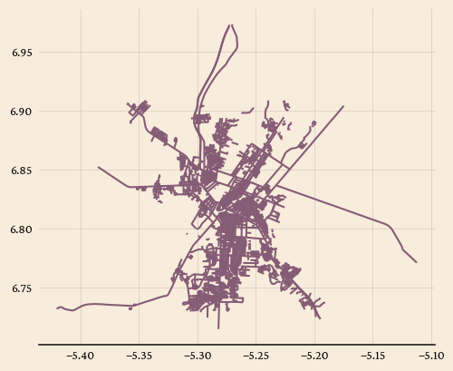

-   Ou un **GeoDataFrame polygonal** :

``` python
# batiment de la région du béré
gdf = civ_data[civ_data["shapeName"]=="Belier"] # région du béré 
buildings = osm.get_data(gdf, {"building": "yes"}, data_type="polygons")
buildings.head()
```

<div>
<style scoped>
    .dataframe tbody tr th:only-of-type {
        vertical-align: middle;
    }

    .dataframe tbody tr th {
        vertical-align: top;
    }

    .dataframe thead th {
        text-align: right;
    }
</style>

<table class="dataframe" data-quarto-postprocess="true" data-border="1">
<thead>
<tr style="text-align: right;">
<th data-quarto-table-cell-role="th"></th>
<th data-quarto-table-cell-role="th"></th>
<th data-quarto-table-cell-role="th">geometry</th>
<th data-quarto-table-cell-role="th">addr:city</th>
<th data-quarto-table-cell-role="th">building</th>
<th data-quarto-table-cell-role="th">name</th>
<th data-quarto-table-cell-role="th">amenity</th>
<th data-quarto-table-cell-role="th">operator</th>
<th data-quarto-table-cell-role="th">religion</th>
<th data-quarto-table-cell-role="th">man_made</th>
<th data-quarto-table-cell-role="th">source</th>
<th data-quarto-table-cell-role="th">building:levels</th>
<th data-quarto-table-cell-role="th">denomination</th>
<th data-quarto-table-cell-role="th">shop</th>
<th data-quarto-table-cell-role="th">office</th>
<th data-quarto-table-cell-role="th">bus</th>
<th data-quarto-table-cell-role="th">public_transport</th>
<th data-quarto-table-cell-role="th">healthcare</th>
<th data-quarto-table-cell-role="th">townhall:type</th>
<th data-quarto-table-cell-role="th">government</th>
<th data-quarto-table-cell-role="th">content</th>
<th data-quarto-table-cell-role="th">type</th>
</tr>
<tr>
<th data-quarto-table-cell-role="th">element</th>
<th data-quarto-table-cell-role="th">id</th>
<th data-quarto-table-cell-role="th"></th>
<th data-quarto-table-cell-role="th"></th>
<th data-quarto-table-cell-role="th"></th>
<th data-quarto-table-cell-role="th"></th>
<th data-quarto-table-cell-role="th"></th>
<th data-quarto-table-cell-role="th"></th>
<th data-quarto-table-cell-role="th"></th>
<th data-quarto-table-cell-role="th"></th>
<th data-quarto-table-cell-role="th"></th>
<th data-quarto-table-cell-role="th"></th>
<th data-quarto-table-cell-role="th"></th>
<th data-quarto-table-cell-role="th"></th>
<th data-quarto-table-cell-role="th"></th>
<th data-quarto-table-cell-role="th"></th>
<th data-quarto-table-cell-role="th"></th>
<th data-quarto-table-cell-role="th"></th>
<th data-quarto-table-cell-role="th"></th>
<th data-quarto-table-cell-role="th"></th>
<th data-quarto-table-cell-role="th"></th>
<th data-quarto-table-cell-role="th"></th>
</tr>
</thead>
<tbody>
<tr>
<td rowspan="5" data-quarto-table-cell-role="th"
data-valign="top">relation</td>
<td data-quarto-table-cell-role="th">11341185</td>
<td>POLYGON ((-4.76881 7.42618, -4.76902 7.42595, ...</td>
<td>NaN</td>
<td>yes</td>
<td>NaN</td>
<td>NaN</td>
<td>NaN</td>
<td>NaN</td>
<td>NaN</td>
<td>NaN</td>
<td>NaN</td>
<td>NaN</td>
<td>NaN</td>
<td>NaN</td>
<td>NaN</td>
<td>NaN</td>
<td>NaN</td>
<td>NaN</td>
<td>NaN</td>
<td>NaN</td>
<td>multipolygon</td>
</tr>
<tr>
<td data-quarto-table-cell-role="th">12160778</td>
<td>POLYGON ((-5.02304 6.55385, -5.02284 6.55391, ...</td>
<td>NaN</td>
<td>yes</td>
<td>NaN</td>
<td>NaN</td>
<td>NaN</td>
<td>NaN</td>
<td>NaN</td>
<td>NaN</td>
<td>NaN</td>
<td>NaN</td>
<td>NaN</td>
<td>NaN</td>
<td>NaN</td>
<td>NaN</td>
<td>NaN</td>
<td>NaN</td>
<td>NaN</td>
<td>NaN</td>
<td>multipolygon</td>
</tr>
<tr>
<td data-quarto-table-cell-role="th">12481444</td>
<td>POLYGON ((-5.01941 6.55768, -5.01938 6.55751, ...</td>
<td>NaN</td>
<td>yes</td>
<td>NaN</td>
<td>NaN</td>
<td>NaN</td>
<td>NaN</td>
<td>NaN</td>
<td>NaN</td>
<td>NaN</td>
<td>NaN</td>
<td>NaN</td>
<td>NaN</td>
<td>NaN</td>
<td>NaN</td>
<td>NaN</td>
<td>NaN</td>
<td>NaN</td>
<td>NaN</td>
<td>multipolygon</td>
</tr>
<tr>
<td data-quarto-table-cell-role="th">16542174</td>
<td>POLYGON ((-5.07582 6.584, -5.07581 6.58376, -5...</td>
<td>NaN</td>
<td>yes</td>
<td>NaN</td>
<td>NaN</td>
<td>NaN</td>
<td>NaN</td>
<td>NaN</td>
<td>NaN</td>
<td>NaN</td>
<td>NaN</td>
<td>NaN</td>
<td>NaN</td>
<td>NaN</td>
<td>NaN</td>
<td>NaN</td>
<td>NaN</td>
<td>NaN</td>
<td>NaN</td>
<td>multipolygon</td>
</tr>
<tr>
<td data-quarto-table-cell-role="th">16542175</td>
<td>POLYGON ((-5.02682 6.56471, -5.02691 6.56456, ...</td>
<td>NaN</td>
<td>yes</td>
<td>NaN</td>
<td>NaN</td>
<td>NaN</td>
<td>NaN</td>
<td>NaN</td>
<td>NaN</td>
<td>NaN</td>
<td>NaN</td>
<td>NaN</td>
<td>NaN</td>
<td>NaN</td>
<td>NaN</td>
<td>NaN</td>
<td>NaN</td>
<td>NaN</td>
<td>NaN</td>
<td>multipolygon</td>
</tr>
</tbody>
</table>

</div>

``` python
buildings.plot(facecolor="red")
```

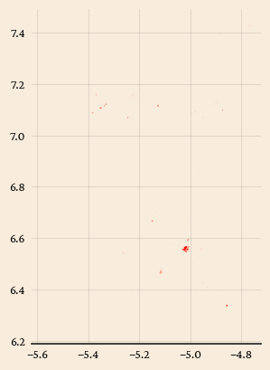

### **Obtenir des données de la Bank Mondiale**

Vous pouvez utiliser la class `WorldBank` de data pour cela.

``` python
from cartograpy import data
wb=data.WorldBank()
```

#### **Obtenir les sources de données**

``` python
wb.get_sources()
```

#### **Obtenir les indicateurs disponibles dans une source de données**

``` python
# 11 Correcpond a la source Africa Development Indicators

wb.get_indicators(11)
```

#### **Obtenir la liste des pays selon une requette**

``` python
wb.get_countries(query="cote")
```

    id    name
    ----  -------------
    CIV   Cote d'Ivoire

#### **Télécharger des données données d’un indicateurs**

Nous allons maintenant telecharger les données de l’indicateur
`AG.AID.NCREL.MT` qui indique le montant total, en dollars américains
courants, de l’aide publique au développement (APD) nette et de l’aide
officielle reçue par un pays au cours d’une année.

Nous utiliserons pour ce faire la méthode get_data

**`get_data(self, indicators, country='all', **kwrargs)`**

Cette méthode permet de **télécharger des données de la Banque
mondiale** pour un ou plusieurs indicateurs, et pour un ou plusieurs
pays, sur une période définie. Elle s’appuie sur le package `wbdata`
pour accéder directement aux bases de données du World Bank Group.

-   **Paramètres :**

    -   `indicators` : un **dictionnaire** (ou une liste) des codes
        d’indicateurs Banque mondiale à récupérer, par exemple :
        `{"AG.AID.CREL.MT": "Aide reçue nette"}` ou bien
        `["AG.AID.CREL.MT"]`.

    -   `country` : code du pays (ISO alpha-3, ex. : `"CIV"` pour la
        Côte d’Ivoire) ou `"all"` pour tous les pays.

    -   `**kwrargs` : autres arguments optionnels à passer à la
        fonction, par exemple :

        -   `date` : période à récupérer, sous forme de tuple ou de
            string (`("2017","2020")`)
        -   `freq` : fréquence des données (`"Y"` pour annuel)
        -   etc.

-   **Retour :**

    -   Un **DataFrame pandas** contenant les valeurs des indicateurs
        demandés pour le(s) pays et la période indiqués.

``` python
# Données de 2010 à 2012 pour la Côte d'Ivoire
wb.get_data({"AG.AID.CREL.MT": "Aide nette"},"CIV",date=("2010","2012"))
```

<div>
<style scoped>
    .dataframe tbody tr th:only-of-type {
        vertical-align: middle;
    }

    .dataframe tbody tr th {
        vertical-align: top;
    }

    .dataframe thead th {
        text-align: right;
    }
</style>

<table class="dataframe" data-quarto-postprocess="true" data-border="1">
<thead>
<tr style="text-align: right;">
<th data-quarto-table-cell-role="th"></th>
<th data-quarto-table-cell-role="th">Aide nette</th>
</tr>
<tr>
<th data-quarto-table-cell-role="th">date</th>
<th data-quarto-table-cell-role="th"></th>
</tr>
</thead>
<tbody>
<tr>
<td data-quarto-table-cell-role="th">2012</td>
<td>20940.000</td>
</tr>
<tr>
<td data-quarto-table-cell-role="th">2011</td>
<td>25012.995</td>
</tr>
<tr>
<td data-quarto-table-cell-role="th">2010</td>
<td>12649.200</td>
</tr>
</tbody>
</table>

</div>

## **Processing de données**

`processing` vous permet d’executer des taches courantes effectuées sur
des données vectorielles. Ce modules comportes plusieurs fonctions pour
le chargement, le traitement et la sauvegarde de données vectorielles.

<figure class=''>


</figure>

``` python
# Importation
from cartograpy.processing import *
```

### **Charger des données**

`load(filepath)`

Cette fonction permet de **charger un fichier de données vectorielles**
(shapefile, GeoJSON, GPKG, KML, GPX, CSV, parquet, etc.), quel que soit
son format. Elle détecte l’extension du fichier et utilise la méthode
adaptée pour lire le fichier sous forme de `GeoDataFrame` (pour les
formats géospatiaux) ou de `DataFrame` classique (pour CSV/parquet).  
**Paramètre** :

-   `filepath` (str) : chemin du fichier à charger.

``` python
# Chargement de données volumineuses
# hexagon_data=load("data\other\hexagon 0.2_Jointure data raster.geojson")
# hexagon_data.head()
```

``` python
# Chargement de mutipolygone
path="data\other\Département de Bouna.geojson"
donnee_bouna=load(path)
donnee_bouna.head()
```

    <>:2: SyntaxWarning: invalid escape sequence '\o'
    <>:2: SyntaxWarning: invalid escape sequence '\o'
    C:\Users\kanic\AppData\Local\Temp\ipykernel_25984\116216181.py:2: SyntaxWarning: invalid escape sequence '\o'
      path="data\other\Département de Bouna.geojson"

<div>
<style scoped>
    .dataframe tbody tr th:only-of-type {
        vertical-align: middle;
    }

    .dataframe tbody tr th {
        vertical-align: top;
    }

    .dataframe thead th {
        text-align: right;
    }
</style>

<table class="dataframe" data-quarto-postprocess="true" data-border="1">
<thead>
<tr style="text-align: right;">
<th data-quarto-table-cell-role="th"></th>
<th data-quarto-table-cell-role="th">id</th>
<th data-quarto-table-cell-role="th">Name</th>
<th data-quarto-table-cell-role="th">description</th>
<th data-quarto-table-cell-role="th">timestamp</th>
<th data-quarto-table-cell-role="th">begin</th>
<th data-quarto-table-cell-role="th">end</th>
<th data-quarto-table-cell-role="th">altitudeMode</th>
<th data-quarto-table-cell-role="th">tessellate</th>
<th data-quarto-table-cell-role="th">extrude</th>
<th data-quarto-table-cell-role="th">visibility</th>
<th data-quarto-table-cell-role="th">drawOrder</th>
<th data-quarto-table-cell-role="th">icon</th>
<th data-quarto-table-cell-role="th">snippet</th>
<th data-quarto-table-cell-role="th">geometry</th>
</tr>
</thead>
<tbody>
<tr>
<td data-quarto-table-cell-role="th">0</td>
<td>ID_00022</td>
<td>Bouna</td>
<td>&lt;html xmlns:fo="http://www.w3.org/1999/XSL/For...</td>
<td>None</td>
<td>None</td>
<td>None</td>
<td>clampToGround</td>
<td>-1</td>
<td>0</td>
<td>-1</td>
<td>None</td>
<td>None</td>
<td></td>
<td>MULTIPOLYGON Z (((-4.19952 9.61499 0, -4.209 9...</td>
</tr>
</tbody>
</table>

</div>

### **Obtenir des informations sur un multipolygone**

`get_multipolygon_info(multipolygon)`

Retourne **un dictionnaire d’informations** sur un MultiPolygon (ou
Polygon) : nombre de polygones, aires, bornes, aire totale, plus
grand/petit polygone, etc.  
**Paramètre** :

-   `multipolygon` (MultiPolygon ou str) : objet à analyser

``` python
multipolygon=donnee_bouna["geometry"][0]
infos_multipolygon=get_multipolygon_info(multipolygon)
infos_multipolygon
```

    {'type': 'MultiPolygon',
     'num_polygons': 1,
     'total_area': 1.1852617495377915,
     'bounds': (-4.297637881999947,
      8.508406537000042,
      -2.596283662999952,
      9.616030601000034),
     'areas': [1.1852617495377915],
     'largest_polygon_area': 1.1852617495377915,
     'smallest_polygon_area': 1.1852617495377915}

### **Séparer un multipolygon en polygone simple**

`split_multipolygon(multipolygon, return_type='geodataframe')`

Sépare un **objet MultiPolygon** (ou sa représentation WKT, ou une
GeoDataFrame) en polygones individuels, et retourne soit une liste de
polygones, soit un GeoDataFrame.  
**Paramètres** :

-   `multipolygon` (MultiPolygon, str ou GeoDataFrame) : objet à séparer

-   `return_type` (str) : format du résultat (‘list’ ou ‘geodataframe’)

``` python
polygones_bouna=split_multipolygon(donnee_bouna)
polygones_bouna.head()
```

<div>
<style scoped>
    .dataframe tbody tr th:only-of-type {
        vertical-align: middle;
    }

    .dataframe tbody tr th {
        vertical-align: top;
    }

    .dataframe thead th {
        text-align: right;
    }
</style>

<table class="dataframe" data-quarto-postprocess="true" data-border="1">
<thead>
<tr style="text-align: right;">
<th data-quarto-table-cell-role="th"></th>
<th data-quarto-table-cell-role="th">id</th>
<th data-quarto-table-cell-role="th">Name</th>
<th data-quarto-table-cell-role="th">description</th>
<th data-quarto-table-cell-role="th">timestamp</th>
<th data-quarto-table-cell-role="th">begin</th>
<th data-quarto-table-cell-role="th">end</th>
<th data-quarto-table-cell-role="th">altitudeMode</th>
<th data-quarto-table-cell-role="th">tessellate</th>
<th data-quarto-table-cell-role="th">extrude</th>
<th data-quarto-table-cell-role="th">visibility</th>
<th data-quarto-table-cell-role="th">drawOrder</th>
<th data-quarto-table-cell-role="th">icon</th>
<th data-quarto-table-cell-role="th">snippet</th>
<th data-quarto-table-cell-role="th">geometry</th>
<th data-quarto-table-cell-role="th">original_index</th>
<th data-quarto-table-cell-role="th">polygon_part</th>
</tr>
</thead>
<tbody>
<tr>
<td data-quarto-table-cell-role="th">0</td>
<td>ID_00022</td>
<td>Bouna</td>
<td>&lt;html xmlns:fo="http://www.w3.org/1999/XSL/For...</td>
<td>None</td>
<td>None</td>
<td>None</td>
<td>clampToGround</td>
<td>-1</td>
<td>0</td>
<td>-1</td>
<td>None</td>
<td>None</td>
<td></td>
<td>POLYGON Z ((-4.19952 9.61499 0, -4.209 9.61568...</td>
<td>0</td>
<td>0</td>
</tr>
</tbody>
</table>

</div>

``` python
polygones_bouna.plot()
```

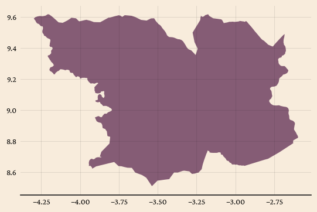

### **Sauvegarder un GeoDataFrame**

`save(geodf, file_extension, filename="output", timestamp=False)`

Cette fonction **sauvegarde un DataFrame ou GeoDataFrame** dans
différents formats (shp, geojson, gpkg, csv, parquet, xlsx, feather,
kml), avec possibilité d’ajouter un timestamp dans le nom du fichier
pour éviter l’écrasement.  
**Paramètres** :

-   `geodf` : le DataFrame ou GeoDataFrame à sauvegarder

-   `file_extension` (str) : format de sortie

-   `filename` (str, optionnel) : nom de base du fichier

-   `timestamp` (bool, optionnel) : ajoute la date/heure au nom

``` python
# Sauvegarde en shapefile
save(polygones_bouna,"shp","data/other/polygone de Bouna")
```

### **Fusionner des geodataframe**

`fusion(dataframes_list, reset_index=True, ignore_crs=True)`

Fusionne (concatène verticalement) **une liste de DataFrames ou
GeoDataFrames**, avec options pour réinitialiser l’index ou ignorer les
conflits de système de coordonnées (CRS).  
**Paramètres** :

-   `dataframes_list` (list) : DataFrames/GeoDataFrames à empiler

-   `reset_index` (bool, optionnel) : réinitialise l’index

-   `ignore_crs` (bool, optionnel) : ignore les conflits de CRS

``` python
# Exemple 2 : Récupérer les limites administratives de plusieurs pays (senegal et mali ici)
countries_data = bound.adm(["SEN", "mali","civ"], "ADM2")
list_gdf=[gdf for key, gdf in countries_data.items()] # Liste de dataframes
countries_merged_data=fusion(list_gdf) # Fusion des dataframes
countries_merged_data.head()
```

<div>
<style scoped>
    .dataframe tbody tr th:only-of-type {
        vertical-align: middle;
    }

    .dataframe tbody tr th {
        vertical-align: top;
    }

    .dataframe thead th {
        text-align: right;
    }
</style>

<table class="dataframe" data-quarto-postprocess="true" data-border="1">
<thead>
<tr style="text-align: right;">
<th data-quarto-table-cell-role="th"></th>
<th data-quarto-table-cell-role="th">geometry</th>
<th data-quarto-table-cell-role="th">shapeName</th>
<th data-quarto-table-cell-role="th">shapeISO</th>
<th data-quarto-table-cell-role="th">shapeID</th>
<th data-quarto-table-cell-role="th">shapeGroup</th>
<th data-quarto-table-cell-role="th">shapeType</th>
</tr>
</thead>
<tbody>
<tr>
<td data-quarto-table-cell-role="th">0</td>
<td>POLYGON ((-11.88782 13.38481, -11.88765 13.391...</td>
<td>Bakel</td>
<td></td>
<td>50182788B16013842146029</td>
<td>SEN</td>
<td>ADM2</td>
</tr>
<tr>
<td data-quarto-table-cell-role="th">1</td>
<td>POLYGON ((-16.38592 15.02258, -16.40452 15.023...</td>
<td>Bambey</td>
<td></td>
<td>50182788B75300917140294</td>
<td>SEN</td>
<td>ADM2</td>
</tr>
<tr>
<td data-quarto-table-cell-role="th">2</td>
<td>POLYGON ((-15.9775 12.88596, -15.97446 12.8904...</td>
<td>Bignona</td>
<td></td>
<td>50182788B19391387689457</td>
<td>SEN</td>
<td>ADM2</td>
</tr>
<tr>
<td data-quarto-table-cell-role="th">3</td>
<td>POLYGON ((-15.59024 13.8291, -15.58246 13.8437...</td>
<td>Birkelane</td>
<td></td>
<td>50182788B56779252201559</td>
<td>SEN</td>
<td>ADM2</td>
</tr>
<tr>
<td data-quarto-table-cell-role="th">4</td>
<td>POLYGON ((-15.9775 12.88596, -15.97 12.89171, ...</td>
<td>Bounkiling</td>
<td></td>
<td>50182788B68388966372963</td>
<td>SEN</td>
<td>ADM2</td>
</tr>
</tbody>
</table>

</div>

### **Creer une nouvelle colonne**

`add_column(df, column_name, expression, globals_dict=None)`

Ajoute **une nouvelle colonne** à un DataFrame/GeoDataFrame, dont les
valeurs sont calculées dynamiquement à partir d’une expression (chaîne
de caractères évaluée ligne par ligne).  
**Paramètres** :

-   `df` : DataFrame/GeoDataFrame d’origine

-   `column_name` (str) : nom de la colonne à créer

-   `expression` (str) : expression à évaluer

-   `globals_dict` (dict, optionnel) : variables globales accessibles
    dans l’expression

``` python
new_countries_data=add_column(df=countries_merged_data,column_name="random_data",expression="random.randint(1,100)",globals_dict={"random":random})
# global_dics correspond a la liste des packages necessaires pour evaluer l'expression
new_countries_data.head()
```

<div>
<style scoped>
    .dataframe tbody tr th:only-of-type {
        vertical-align: middle;
    }

    .dataframe tbody tr th {
        vertical-align: top;
    }

    .dataframe thead th {
        text-align: right;
    }
</style>

<table class="dataframe" data-quarto-postprocess="true" data-border="1">
<thead>
<tr style="text-align: right;">
<th data-quarto-table-cell-role="th"></th>
<th data-quarto-table-cell-role="th">geometry</th>
<th data-quarto-table-cell-role="th">shapeName</th>
<th data-quarto-table-cell-role="th">shapeISO</th>
<th data-quarto-table-cell-role="th">shapeID</th>
<th data-quarto-table-cell-role="th">shapeGroup</th>
<th data-quarto-table-cell-role="th">shapeType</th>
<th data-quarto-table-cell-role="th">random_data</th>
</tr>
</thead>
<tbody>
<tr>
<td data-quarto-table-cell-role="th">0</td>
<td>POLYGON ((-11.88782 13.38481, -11.88765 13.391...</td>
<td>Bakel</td>
<td></td>
<td>50182788B16013842146029</td>
<td>SEN</td>
<td>ADM2</td>
<td>86</td>
</tr>
<tr>
<td data-quarto-table-cell-role="th">1</td>
<td>POLYGON ((-16.38592 15.02258, -16.40452 15.023...</td>
<td>Bambey</td>
<td></td>
<td>50182788B75300917140294</td>
<td>SEN</td>
<td>ADM2</td>
<td>2</td>
</tr>
<tr>
<td data-quarto-table-cell-role="th">2</td>
<td>POLYGON ((-15.9775 12.88596, -15.97446 12.8904...</td>
<td>Bignona</td>
<td></td>
<td>50182788B19391387689457</td>
<td>SEN</td>
<td>ADM2</td>
<td>9</td>
</tr>
<tr>
<td data-quarto-table-cell-role="th">3</td>
<td>POLYGON ((-15.59024 13.8291, -15.58246 13.8437...</td>
<td>Birkelane</td>
<td></td>
<td>50182788B56779252201559</td>
<td>SEN</td>
<td>ADM2</td>
<td>45</td>
</tr>
<tr>
<td data-quarto-table-cell-role="th">4</td>
<td>POLYGON ((-15.9775 12.88596, -15.97 12.89171, ...</td>
<td>Bounkiling</td>
<td></td>
<td>50182788B68388966372963</td>
<td>SEN</td>
<td>ADM2</td>
<td>98</td>
</tr>
</tbody>
</table>

</div>

``` python

new_countries_data=add_column(new_countries_data,"dataType","row['shapeGroup']+'-'+row['shapeType']")
# 'row' dans l'expression correspont a une ligne de la dataframe. Elle doit être toujours nommée 'row'
# shapeGroup et shapeType sont des colonnes de la dataframe
new_countries_data.head()
```

<div>
<style scoped>
    .dataframe tbody tr th:only-of-type {
        vertical-align: middle;
    }

    .dataframe tbody tr th {
        vertical-align: top;
    }

    .dataframe thead th {
        text-align: right;
    }
</style>

<table class="dataframe" data-quarto-postprocess="true" data-border="1">
<thead>
<tr style="text-align: right;">
<th data-quarto-table-cell-role="th"></th>
<th data-quarto-table-cell-role="th">geometry</th>
<th data-quarto-table-cell-role="th">shapeName</th>
<th data-quarto-table-cell-role="th">shapeISO</th>
<th data-quarto-table-cell-role="th">shapeID</th>
<th data-quarto-table-cell-role="th">shapeGroup</th>
<th data-quarto-table-cell-role="th">shapeType</th>
<th data-quarto-table-cell-role="th">random_data</th>
<th data-quarto-table-cell-role="th">dataType</th>
</tr>
</thead>
<tbody>
<tr>
<td data-quarto-table-cell-role="th">0</td>
<td>POLYGON ((-11.88782 13.38481, -11.88765 13.391...</td>
<td>Bakel</td>
<td></td>
<td>50182788B16013842146029</td>
<td>SEN</td>
<td>ADM2</td>
<td>86</td>
<td>SEN-ADM2</td>
</tr>
<tr>
<td data-quarto-table-cell-role="th">1</td>
<td>POLYGON ((-16.38592 15.02258, -16.40452 15.023...</td>
<td>Bambey</td>
<td></td>
<td>50182788B75300917140294</td>
<td>SEN</td>
<td>ADM2</td>
<td>2</td>
<td>SEN-ADM2</td>
</tr>
<tr>
<td data-quarto-table-cell-role="th">2</td>
<td>POLYGON ((-15.9775 12.88596, -15.97446 12.8904...</td>
<td>Bignona</td>
<td></td>
<td>50182788B19391387689457</td>
<td>SEN</td>
<td>ADM2</td>
<td>9</td>
<td>SEN-ADM2</td>
</tr>
<tr>
<td data-quarto-table-cell-role="th">3</td>
<td>POLYGON ((-15.59024 13.8291, -15.58246 13.8437...</td>
<td>Birkelane</td>
<td></td>
<td>50182788B56779252201559</td>
<td>SEN</td>
<td>ADM2</td>
<td>45</td>
<td>SEN-ADM2</td>
</tr>
<tr>
<td data-quarto-table-cell-role="th">4</td>
<td>POLYGON ((-15.9775 12.88596, -15.97 12.89171, ...</td>
<td>Bounkiling</td>
<td></td>
<td>50182788B68388966372963</td>
<td>SEN</td>
<td>ADM2</td>
<td>98</td>
<td>SEN-ADM2</td>
</tr>
</tbody>
</table>

</div>

``` python
list(new_countries_data.columns)
```

    ['geometry',
     'shapeName',
     'shapeISO',
     'shapeID',
     'shapeGroup',
     'shapeType',
     'random_data',
     'dataType']

### **Creer un geodataframe de centroïde**

`centroids(geodf)`

Crée un **nouveau GeoDataFrame contenant les centroïdes** de chaque
géométrie de l’objet d’entrée.  
**Paramètre** :

-   `geodf` (GeoDataFrame) : table géospatiale d’origine

``` python

coundtries_centroids = centroids(new_countries_data)

# Maintenant coundtries_centroids est un GeoDataFrame de points (centroïdes)
# avec tous les attributs originaux de new_countries_data

coundtries_centroids.head()
```

<div>
<style scoped>
    .dataframe tbody tr th:only-of-type {
        vertical-align: middle;
    }

    .dataframe tbody tr th {
        vertical-align: top;
    }

    .dataframe thead th {
        text-align: right;
    }
</style>

<table class="dataframe" data-quarto-postprocess="true" data-border="1">
<thead>
<tr style="text-align: right;">
<th data-quarto-table-cell-role="th"></th>
<th data-quarto-table-cell-role="th">geometry</th>
<th data-quarto-table-cell-role="th">shapeName</th>
<th data-quarto-table-cell-role="th">shapeISO</th>
<th data-quarto-table-cell-role="th">shapeID</th>
<th data-quarto-table-cell-role="th">shapeGroup</th>
<th data-quarto-table-cell-role="th">shapeType</th>
<th data-quarto-table-cell-role="th">random_data</th>
<th data-quarto-table-cell-role="th">dataType</th>
</tr>
</thead>
<tbody>
<tr>
<td data-quarto-table-cell-role="th">0</td>
<td>POINT (-12.25523 14.17004)</td>
<td>Bakel</td>
<td></td>
<td>50182788B16013842146029</td>
<td>SEN</td>
<td>ADM2</td>
<td>86</td>
<td>SEN-ADM2</td>
</tr>
<tr>
<td data-quarto-table-cell-role="th">1</td>
<td>POINT (-16.48386 14.80261)</td>
<td>Bambey</td>
<td></td>
<td>50182788B75300917140294</td>
<td>SEN</td>
<td>ADM2</td>
<td>2</td>
<td>SEN-ADM2</td>
</tr>
<tr>
<td data-quarto-table-cell-role="th">2</td>
<td>POINT (-16.36673 12.88758)</td>
<td>Bignona</td>
<td></td>
<td>50182788B19391387689457</td>
<td>SEN</td>
<td>ADM2</td>
<td>9</td>
<td>SEN-ADM2</td>
</tr>
<tr>
<td data-quarto-table-cell-role="th">3</td>
<td>POINT (-15.68446 14.05259)</td>
<td>Birkelane</td>
<td></td>
<td>50182788B56779252201559</td>
<td>SEN</td>
<td>ADM2</td>
<td>45</td>
<td>SEN-ADM2</td>
</tr>
<tr>
<td data-quarto-table-cell-role="th">4</td>
<td>POINT (-15.60351 13.13488)</td>
<td>Bounkiling</td>
<td></td>
<td>50182788B68388966372963</td>
<td>SEN</td>
<td>ADM2</td>
<td>98</td>
<td>SEN-ADM2</td>
</tr>
</tbody>
</table>

</div>

``` python

# Visualisation rapide
coundtries_centroids.plot(markersize=50, color='red',label="Centroïde")
```

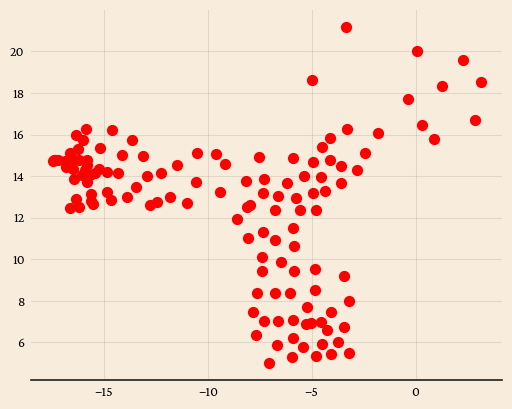

### **Découper selon un masque de geodataframe**

`clip_gdf_by_mask(gdf_source, gdf_emprise, buffer_distance=0, crs="EPSG:4326")`

Découpe (clip) une GeoDataFrame **selon la géométrie d’emprise** d’une
autre GeoDataFrame, avec possibilité d’appliquer un buffer et de gérer
le système de coordonnées.  
**Paramètres** :

-   `gdf_source` (GeoDataFrame) : table à découper

-   `gdf_emprise` (GeoDataFrame) : masque de découpe

-   `buffer_distance` (float, optionnel) : distance de buffer

-   `crs` (str, optionnel) : CRS à utiliser si absent

``` python
rivers_civ=clip_gdf_by_mask(rivers_africa,civ_data)
rivers_civ.head()
```

    c:\Users\kanic\OneDrive\cartograpy\cartograpy\processing.py:494: UserWarning: gdf_emprise n'a pas de CRS défini. Attribution du CRS par défaut: EPSG:4326
      warnings.warn(f"gdf_emprise n'a pas de CRS défini. Attribution du CRS par défaut: {crs}")
    c:\Users\kanic\OneDrive\cartograpy\cartograpy\processing.py:502: DeprecationWarning: The 'unary_union' attribute is deprecated, use the 'union_all()' method instead.
      emprise_totale = gdf_emprise.geometry.unary_union

<div>
<style scoped>
    .dataframe tbody tr th:only-of-type {
        vertical-align: middle;
    }

    .dataframe tbody tr th {
        vertical-align: top;
    }

    .dataframe thead th {
        text-align: right;
    }
</style>

<table class="dataframe" data-quarto-postprocess="true" data-border="1">
<thead>
<tr style="text-align: right;">
<th data-quarto-table-cell-role="th"></th>
<th data-quarto-table-cell-role="th">HYRIV_ID</th>
<th data-quarto-table-cell-role="th">NEXT_DOWN</th>
<th data-quarto-table-cell-role="th">MAIN_RIV</th>
<th data-quarto-table-cell-role="th">LENGTH_KM</th>
<th data-quarto-table-cell-role="th">DIST_DN_KM</th>
<th data-quarto-table-cell-role="th">DIST_UP_KM</th>
<th data-quarto-table-cell-role="th">CATCH_SKM</th>
<th data-quarto-table-cell-role="th">UPLAND_SKM</th>
<th data-quarto-table-cell-role="th">ENDORHEIC</th>
<th data-quarto-table-cell-role="th">DIS_AV_CMS</th>
<th data-quarto-table-cell-role="th">ORD_STRA</th>
<th data-quarto-table-cell-role="th">ORD_CLAS</th>
<th data-quarto-table-cell-role="th">ORD_FLOW</th>
<th data-quarto-table-cell-role="th">HYBAS_L12</th>
<th data-quarto-table-cell-role="th">geometry</th>
</tr>
</thead>
<tbody>
<tr>
<td data-quarto-table-cell-role="th">601281</td>
<td>10601282</td>
<td>10600136</td>
<td>10877687</td>
<td>3.85</td>
<td>3711.6</td>
<td>8.3</td>
<td>21.09</td>
<td>21.1</td>
<td>0</td>
<td>0.103</td>
<td>1</td>
<td>5</td>
<td>7</td>
<td>1120784650</td>
<td>LINESTRING (-6.26875 10.72917, -6.26875 10.73999)</td>
</tr>
<tr>
<td data-quarto-table-cell-role="th">601419</td>
<td>10601420</td>
<td>10599829</td>
<td>10877687</td>
<td>5.83</td>
<td>3708.9</td>
<td>300.2</td>
<td>26.15</td>
<td>10211.1</td>
<td>0</td>
<td>100.955</td>
<td>4</td>
<td>3</td>
<td>4</td>
<td>1120784660</td>
<td>LINESTRING (-6.22708 10.72708, -6.22292 10.731...</td>
</tr>
<tr>
<td data-quarto-table-cell-role="th">601851</td>
<td>10601852</td>
<td>10601420</td>
<td>10877687</td>
<td>2.67</td>
<td>3714.5</td>
<td>42.2</td>
<td>3.59</td>
<td>426.6</td>
<td>0</td>
<td>2.249</td>
<td>3</td>
<td>4</td>
<td>6</td>
<td>1120786120</td>
<td>LINESTRING (-6.22188 10.72604, -6.22292 10.727...</td>
</tr>
<tr>
<td data-quarto-table-cell-role="th">602019</td>
<td>10602020</td>
<td>10603004</td>
<td>10877687</td>
<td>2.44</td>
<td>3741.0</td>
<td>7.3</td>
<td>22.15</td>
<td>22.1</td>
<td>0</td>
<td>0.113</td>
<td>1</td>
<td>5</td>
<td>7</td>
<td>1121946950</td>
<td>LINESTRING (-6.40542 10.71375, -6.40208 10.71042)</td>
</tr>
<tr>
<td data-quarto-table-cell-role="th">602170</td>
<td>10602171</td>
<td>10603004</td>
<td>10877687</td>
<td>0.97</td>
<td>3741.0</td>
<td>5.7</td>
<td>11.39</td>
<td>11.4</td>
<td>0</td>
<td>0.060</td>
<td>1</td>
<td>6</td>
<td>8</td>
<td>1121946950</td>
<td>LINESTRING (-6.40833 10.70417, -6.40208 10.71042)</td>
</tr>
</tbody>
</table>

</div>

## **Visualisation de données**

cartograpy permet de creer rapidement des cartes pour visualier les
données géographiques grace son module `mapper`.

Le principe de création de cartes simples et intuitives avec cartograpy
repose sur l’utilisation de la classe `Map`, qui permet de générer des
rendus statiques de cartes. Les étapes sont les suivantes :

-   Créer un objet `Map`
-   Personnaliser le format de papier avec des dimensions
    internationales (A4, A3, B2, etc.)
-   Ajouter vos couches de données
-   Ajuster le style à votre convenance (ajout de flèche du nord, de
    légende, d’échelle, etc.)
-   Afficher la carte

C’est aussi simple que ça !

<figure class=''>


</figure>

``` python
from cartograpy.mapper import *
```

Nous allons ajouter des données aléatoire a nos données vectorielle pour
avec `random` pour la demonstration

``` python
# J'ajoute des données aléatoires a civ_data
import random
civ_data['data'] = [random.randint(0,10000) for i in range(len(civ_data))]
```

``` python
civ_data.head()
```

<div>
<style scoped>
    .dataframe tbody tr th:only-of-type {
        vertical-align: middle;
    }

    .dataframe tbody tr th {
        vertical-align: top;
    }

    .dataframe thead th {
        text-align: right;
    }
</style>

<table class="dataframe" data-quarto-postprocess="true" data-border="1">
<thead>
<tr style="text-align: right;">
<th data-quarto-table-cell-role="th"></th>
<th data-quarto-table-cell-role="th">geometry</th>
<th data-quarto-table-cell-role="th">shapeName</th>
<th data-quarto-table-cell-role="th">shapeISO</th>
<th data-quarto-table-cell-role="th">shapeID</th>
<th data-quarto-table-cell-role="th">shapeGroup</th>
<th data-quarto-table-cell-role="th">shapeType</th>
<th data-quarto-table-cell-role="th">data</th>
</tr>
</thead>
<tbody>
<tr>
<td data-quarto-table-cell-role="th">0</td>
<td>POLYGON ((-4.68451 6.27179, -4.6868 6.26883, -...</td>
<td>Agneby-Tiassa</td>
<td></td>
<td>98640826B52449815511854</td>
<td>CIV</td>
<td>ADM2</td>
<td>4194</td>
</tr>
<tr>
<td data-quarto-table-cell-role="th">1</td>
<td>POLYGON ((-7.71925 9.07004, -7.72574 9.06397, ...</td>
<td>Bafing</td>
<td></td>
<td>98640826B37750272367318</td>
<td>CIV</td>
<td>ADM2</td>
<td>6701</td>
</tr>
<tr>
<td data-quarto-table-cell-role="th">2</td>
<td>POLYGON ((-6.19702 10.24246, -6.20038 10.24495...</td>
<td>Bagoue</td>
<td></td>
<td>98640826B26044148659027</td>
<td>CIV</td>
<td>ADM2</td>
<td>9747</td>
</tr>
<tr>
<td data-quarto-table-cell-role="th">3</td>
<td>MULTIPOLYGON (((-4.68451 6.27179, -4.68338 6.2...</td>
<td>Belier</td>
<td></td>
<td>98640826B5123145245776</td>
<td>CIV</td>
<td>ADM2</td>
<td>7948</td>
</tr>
<tr>
<td data-quarto-table-cell-role="th">4</td>
<td>POLYGON ((-6.70042 9.06196, -6.70118 9.05639, ...</td>
<td>Bere</td>
<td></td>
<td>98640826B43857880322183</td>
<td>CIV</td>
<td>ADM2</td>
<td>2987</td>
</tr>
</tbody>
</table>

</div>

``` python
# Ajout de données aléatoire a geocode_localite
geocode_localite=resultat_geocode[0]
geocode_localite["data"]= [random.randint(0,10000) for i in range(len(geocode_localite))]
geocode_localite.head()
```

<div>
<style scoped>
    .dataframe tbody tr th:only-of-type {
        vertical-align: middle;
    }

    .dataframe tbody tr th {
        vertical-align: top;
    }

    .dataframe thead th {
        text-align: right;
    }
</style>

<table class="dataframe" data-quarto-postprocess="true" data-border="1">
<thead>
<tr style="text-align: right;">
<th data-quarto-table-cell-role="th"></th>
<th data-quarto-table-cell-role="th">query</th>
<th data-quarto-table-cell-role="th">address</th>
<th data-quarto-table-cell-role="th">latitude</th>
<th data-quarto-table-cell-role="th">longitude</th>
<th data-quarto-table-cell-role="th">altitude</th>
<th data-quarto-table-cell-role="th">raw</th>
<th data-quarto-table-cell-role="th">geometry</th>
<th data-quarto-table-cell-role="th">data</th>
</tr>
</thead>
<tbody>
<tr>
<td data-quarto-table-cell-role="th">0</td>
<td>Abidjan</td>
<td>Abidjan, Côte d’Ivoire</td>
<td>5.320357</td>
<td>-4.016107</td>
<td>0.0</td>
<td>{'place_id': 275930228, 'licence': 'Data © Ope...</td>
<td>POINT (-4.01611 5.32036)</td>
<td>6307</td>
</tr>
<tr>
<td data-quarto-table-cell-role="th">1</td>
<td>Yamoussoukro</td>
<td>Yamoussoukro, Côte d’Ivoire</td>
<td>6.820007</td>
<td>-5.277603</td>
<td>0.0</td>
<td>{'place_id': 405334522, 'licence': 'Data © Ope...</td>
<td>POINT (-5.2776 6.82001)</td>
<td>8907</td>
</tr>
<tr>
<td data-quarto-table-cell-role="th">2</td>
<td>Bouaké</td>
<td>Bouaké, Gbêkê, Vallée du Bandama, Côte d’Ivoire</td>
<td>7.689021</td>
<td>-5.028355</td>
<td>0.0</td>
<td>{'place_id': 275820936, 'licence': 'Data © Ope...</td>
<td>POINT (-5.02836 7.68902)</td>
<td>8963</td>
</tr>
<tr>
<td data-quarto-table-cell-role="th">3</td>
<td>Korhogo</td>
<td>Korhogo, Poro, Savanes, Côte d’Ivoire</td>
<td>9.458070</td>
<td>-5.631629</td>
<td>0.0</td>
<td>{'place_id': 276083703, 'licence': 'Data © Ope...</td>
<td>POINT (-5.63163 9.45807)</td>
<td>1177</td>
</tr>
<tr>
<td data-quarto-table-cell-role="th">4</td>
<td>Man CI</td>
<td>Man, Tonkpi, Montagnes, Côte d’Ivoire</td>
<td>7.410258</td>
<td>-7.550372</td>
<td>0.0</td>
<td>{'place_id': 277270784, 'licence': 'Data © Ope...</td>
<td>POINT (-7.55037 7.41026)</td>
<td>5985</td>
</tr>
</tbody>
</table>

</div>

### **Visualiser des données rasters**

``` python
# Création d'une carte raster
carte_dem = Map(figsize=(12, 8), projection=ccrs.PlateCarree())

# Ajout d'une couche raster
carte_dem.add_raster('data\other\Limite DEM Bouna.tif', cmap='tab20c', title='Élévation (m)')

font_name=get_fonts("couri")[0]

carte_dem.set_font(font_name, size=10)
carte_dem.set_title('Topographique de bouna', fontsize=17, color='Black', pad=20)
carte_dem.add_arrow(3, position=(-2.70, 9.55), zoom=0.05, color='black')
carte_dem.add_gridlines()
carte_dem.add_scale_bar(length=20, units="km",pad=0.01)
carte_dem.show()


# Sauvegarde
# carte.save('carte_demo.png')
```

    <>:5: SyntaxWarning: invalid escape sequence '\o'
    <>:5: SyntaxWarning: invalid escape sequence '\o'
    C:\Users\kanic\AppData\Local\Temp\ipykernel_25984\2322661019.py:5: SyntaxWarning: invalid escape sequence '\o'
      carte_dem.add_raster('data\other\Limite DEM Bouna.tif', cmap='tab20c', title='Élévation (m)')
    WARNING:svglib.svglib:Can't handle color: param(outline)
    WARNING:svglib.svglib:Can't handle color: param(outline)

    Location est : (0.1, 0.05). La bare d'échelle est placé à 10.0 % de la longeur et à 5.0 % de la hauteur)

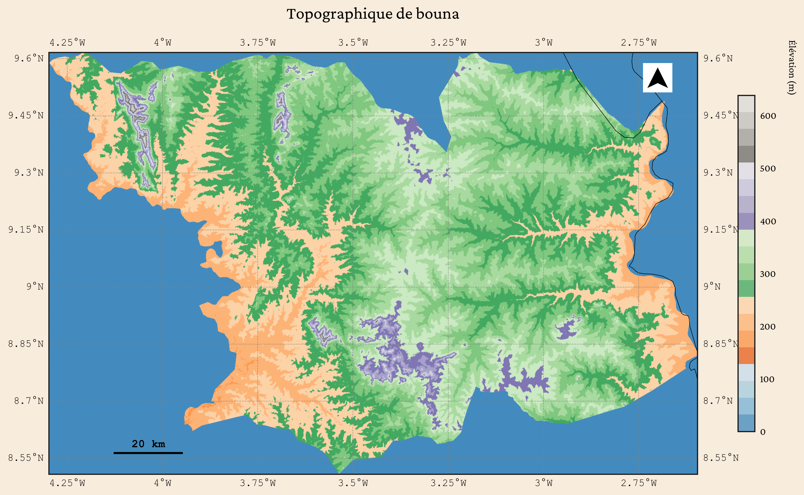

### **Visualiser des données vectorielles**

#### **Carte de cloropleth de points et polygones simplement**

``` python
import morethemes as mt
mt.set_theme("wsj")
```

``` python
carte_ci=Map(figsize=(16, 12), projection=ccrs.PlateCarree(),title="Carte cloropleth de données aléatoires")
carte_ci.add_polygons_cloropleth(gdf=civ_data,
                              column_to_plot='data',
                                title='Légende',
                                cmap='tab20c',
                                )
carte_ci.add_points_cloropleth(
    gdf=geocode_localite,
    column_to_plot="data",
    label_column="query",
    point_size_column="data",
    show_colorbar=False,
    cmap="tab20c"
    
)
carte_ci.add_gridlines()
font_name=get_fonts("time")[0]
carte_ci.set_font(font_name, size=12)
carte_ci.add_arrow(3, position=(-1.5,10.75),zoom=0.06, color="black")
carte_ci.figsize=(18,16)
carte_ci.show()
```

    Warning: No CRS defined for geodf. Setting default CRS to EPSG:4326

    WARNING:svglib.svglib:Can't handle color: param(outline)
    WARNING:svglib.svglib:Can't handle color: param(outline)

    📊 Centrage intelligent appliqué:
       Format: Personnalisé (N/A)
       Ratio figure: 1.33
       Ratio données: 0.95
       Étendue: [-10.39, -0.69, 3.91, 11.19]
    📊 Centrage intelligent appliqué:
       Format: Personnalisé (N/A)
       Ratio figure: 1.33
       Ratio données: 0.95
       Étendue: [-10.39, -0.69, 3.91, 11.19]

#### **Carte cloropleth de points**

``` python
# Creer un simple cloropleth de point
#============================================
carte2=Map(figsize="A4")
centroide=centroids(geodf=civ_data)
# civ_bound0=client.adm("civ","ADM0")
# carte2.add_polygons(civ_bound0)
carte2.add_points_cloropleth(gdf=centroide,column_to_plot="data",point_size_column="data",alpha=1,show_colorbar=True,show_size_legend=False)
carte2.add_gridlines()
carte2.set_title("Cloropleth de point avec points")
carte2.show()
```

    📄 Format de papier: A4 (landscape) - Dimensions: 210 x 297 mm - Figure: 11.7" x 8.3"
    Warning: No CRS defined for geodf. Setting default CRS to EPSG:4326
    📊 Centrage intelligent appliqué:
       Format: A4 (landscape)
       Ratio figure: 1.41
       Ratio données: 0.91
       Étendue: [-9.82, -1.18, 4.50, 10.61]
    📊 Centrage intelligent appliqué:
       Format: A4 (landscape)
       Ratio figure: 1.41
       Ratio données: 0.91
       Étendue: [-9.82, -1.18, 4.50, 10.61]

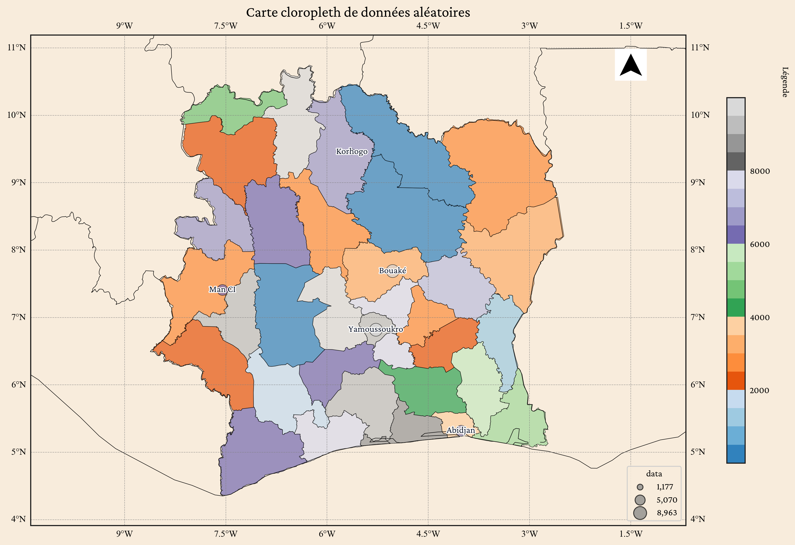

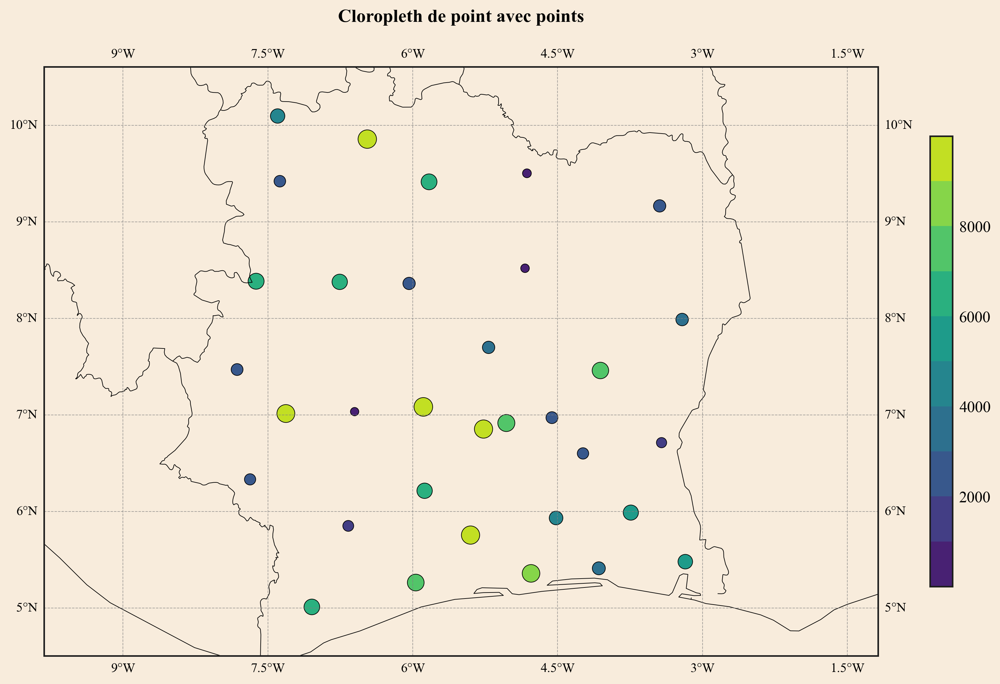

#### **Creer une carte de ppersonnalisé de vecteurs (etiquette, orientation du nord, légende et echelle)**

Nous allons modifier légèrement les noms `shapeName` de Yamoussoukro et
Abidjan pour faciliter la lecture.

``` python
# list(civ_data.shapeName.unique()) # liste des valeurs uniques de la colonne 'shapeName'
civ_data["shapeName"].replace({
    "District Autonome D'Abidjan": "Abidjan",
    "District Autonome De Yamoussoukro": "Yamoussoukro"
}, inplace=True)
```

    C:\Users\kanic\AppData\Local\Temp\ipykernel_25984\3282224376.py:2: FutureWarning: A value is trying to be set on a copy of a DataFrame or Series through chained assignment using an inplace method.
    The behavior will change in pandas 3.0. This inplace method will never work because the intermediate object on which we are setting values always behaves as a copy.

    For example, when doing 'df[col].method(value, inplace=True)', try using 'df.method({col: value}, inplace=True)' or df[col] = df[col].method(value) instead, to perform the operation inplace on the original object.


      civ_data["shapeName"].replace({

``` python

# Creer un objet de carte basique avec OpenLayers et Python
# =========================================================
carte1=Map(figsize="A4",title="Carte de la Côte d'Ivoire")

# Ajouter des couches de données
# =========================================================
carte1.add_polygons(gdf=civ_data,label="Limite des régions",facecolor="orange")
carte1.add_points(gdf=geocode_localite,label="Zone d'enquête")

# Ajouter des etiquettes
# =========================================================
carte1.add_labels(
    gdf=civ_data,
    label_column='shapeName',
    # custom_label="{row['data']}\n{row['shapeName']}", #Pour personnaliser l'affichage
    fontsize=8,
    # color="#e2f201",
    outline_width=1,
    fontweight="bold"
)

# Mofifier la tailles du papier en A4
# =========================================================
carte1.set_paper("A4")

# Ajouter les grilles de coordonnées
# =========================================================
carte1.add_gridlines(top_right=True,fontsize=12)

# Ajouter la légende
# =========================================================
carte1.legend_presets("simple", title="Légende", title_fontsize=12, fontsize=12,loc="lower right")

# Ajouter une barre d'echelle
# =========================================================
carte1.add_scale_bar(length=100, units="km", linewidth=4, location=(0.02,0.03))

# Ajouter la fleche du nord geographique
# =========================================================
carte1.add_arrow(arrow=3,position=(-0.5,11),zoom=0.05)

# Changer le style de police
# =========================================================
carte1.set_font('Times New Roman')

# Afficher la carte 
# =========================================================
carte1.show(smart_centering=True)

# Enregistrer la carte
# =========================================================
# carte1.save("image.png")
```

    WARNING:svglib.svglib:Can't handle color: param(outline)
    WARNING:svglib.svglib:Can't handle color: param(outline)

    📄 Format de papier: A4 (landscape) - Dimensions: 210 x 297 mm - Figure: 11.7" x 8.3"
    ⚠️  Attention: Aucun CRS défini. Attribution du CRS par défaut: EPSG:4326
    📄 Format mis à jour: A4 (landscape) - Dimensions: 210 x 297 mm - Figure: 11.7" x 8.3"
    {'fontsize': 12, 'title_fontsize': 12, 'frameon': True, 'fancybox': True, 'shadow': False, 'framealpha': 1.0, 'facecolor': 'white', 'edgecolor': '#888', 'borderpad': 1.0, 'columnspacing': 2.0, 'title': 'Légende', 'loc': 'lower right'}
    🛑Element de légende ajouté None
    ✅ Légende personnalisée créée avec 2 éléments
    🎨 Préréglage 'simple' appliqué à la légende
    📊 Centrage intelligent appliqué:
       Format: A4 (landscape)
       Ratio figure: 1.41
       Ratio données: 0.95
       Étendue: [-10.96, -0.12, 3.72, 11.38]
    🛑Element de légende ajouté None
    ✅ Légende personnalisée créée avec 2 éléments
    Location est : (0.02, 0.03). La bare d'échelle est placé à 2.0 % de la longeur et à 3.0 % de la hauteur)

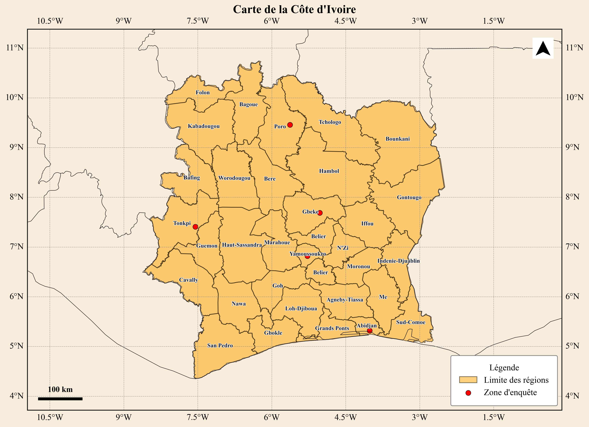

#### **Carte de lignes**

``` python
path="data\\QGIS-Training-Data\\exercise_data\shapefile\\rivers.shp"
data_riviere=load(path)
carte4=Map(title="Carte de rivière")
carte4.set_paper("A4")
carte4.add_lines(data_riviere,color="blue",alpha=0.7,linewidth=1,linestyle="--")
carte4.add_gridlines()
carte4.add_arrow(5,position=(20.56,-33.32),zoom=0.03)
carte4.add_scale_bar(15,units="km", pad=0.01,color="black",linewidth=3, location=(0.05,0.05))
carte4.add_scale_bar(15,units="km", pad=0.01,color="red",linewidth=3, location=(0.15,0.05),label="")
carte4.add_legend_element("line",color="blue",label="Rivière", linestyle="--", linewidth=1)
carte4.legend_presets("minimal" ,loc="lower right")
carte4.show()
```

    <>:1: SyntaxWarning: invalid escape sequence '\s'
    <>:1: SyntaxWarning: invalid escape sequence '\s'
    C:\Users\kanic\AppData\Local\Temp\ipykernel_25984\448199868.py:1: SyntaxWarning: invalid escape sequence '\s'
      path="data\\QGIS-Training-Data\\exercise_data\shapefile\\rivers.shp"
    WARNING:svglib.svglib:Can't handle color: param(outline)

    📄 Format mis à jour: A4 (landscape) - Dimensions: 210 x 297 mm - Figure: 11.7" x 8.3"
    ⚠️  Attention: Le GeoDataFrame contient des géométries nulles qui seront ignorées
    ➕ Élément 'Rivière' ajouté à la légende
    {'fontsize': 9, 'frameon': False, 'fancybox': False, 'shadow': False, 'framealpha': 1.0, 'handlelength': 1.5, 'handletextpad': 0.5, 'loc': 'lower right'}
    🛑Element de légende ajouté None
    ✅ Légende personnalisée créée avec 1 éléments
    🎨 Préréglage 'minimal' appliqué à la légende
    📊 Centrage intelligent appliqué:
       Format: A4 (landscape)
       Ratio figure: 1.41
       Ratio données: 1.70
       Étendue: [19.06, 20.66, -34.39, -33.26]
    🛑Element de légende ajouté None
    ✅ Légende personnalisée créée avec 1 éléments
    Location est : (0.05, 0.05). La bare d'échelle est placé à 5.0 % de la longeur et à 5.0 % de la hauteur)
    Location est : (0.15, 0.05). La bare d'échelle est placé à 15.0 % de la longeur et à 5.0 % de la hauteur)

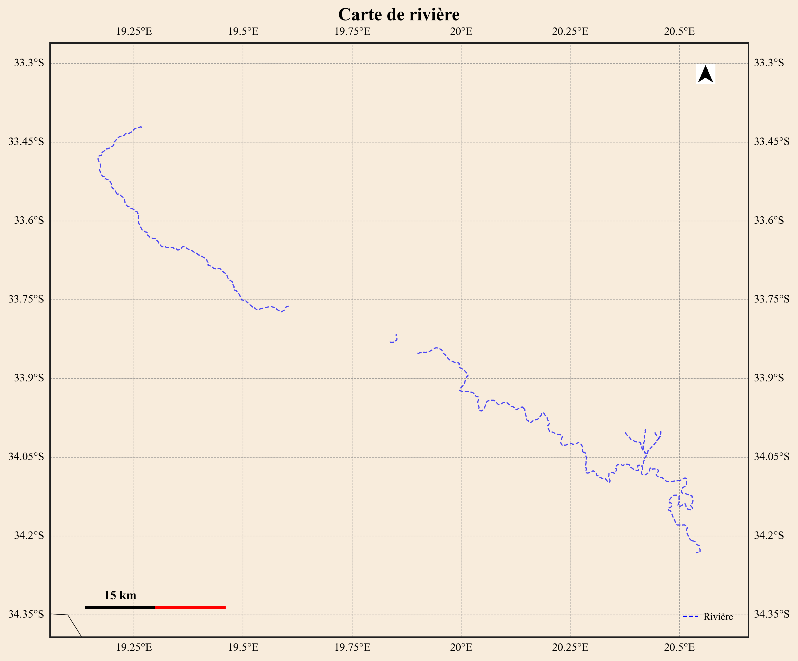

### **Améliorer le style des cartes**

Vous pouvez utiliser explorer et manipuler **les palettes de couleurs**
avec `styling` de cartograpy

``` python
# Chargement de la bibliothèque
from cartograpy.styling import *
```

#### **Les palettes de couleurs**

Les palettes de couleurs et styles disponibles sont ceux de
`matplotlib`, `seaborn`, `mplcyberpunk` et `SciencePlots`.

Pour voir la liste des palettes valides, utilisez la commande
`get_valid_palettes()`.

``` python
# Les groupes de palettes diponibles
get_available_palettes().keys()
```

    dict_keys(['custom', 'seaborn_qualitative', 'seaborn_sequential', 'seaborn_diverging', 'matplotlib_sequential', 'matplotlib_diverging', 'matplotlib_cyclic', 'matplotlib_qualitative'])

``` python
# Voir les pallettes disponibles dans un groupe
get_available_palettes()["seaborn_sequential"]
```

    ['Blues',
     'BuGn',
     'BuPu',
     'GnBu',
     'Greens',
     'Greys',
     'Oranges',
     'OrRd',
     'PuBu',
     'PuBuGn',
     'PuRd',
     'Purples',
     'RdPu',
     'Reds',
     'YlGn',
     'YlGnBu',
     'YlOrBr',
     'YlOrRd',
     'rocket',
     'mako',
     'flare',
     'crest']

``` python
# Ou pour voir toutes celles de matplotlib
print (plt.colormaps())
```

    ['magma', 'inferno', 'plasma', 'viridis', 'cividis', 'twilight', 'twilight_shifted', 'turbo', 'berlin', 'managua', 'vanimo', 'Blues', 'BrBG', 'BuGn', 'BuPu', 'CMRmap', 'GnBu', 'Greens', 'Greys', 'OrRd', 'Oranges', 'PRGn', 'PiYG', 'PuBu', 'PuBuGn', 'PuOr', 'PuRd', 'Purples', 'RdBu', 'RdGy', 'RdPu', 'RdYlBu', 'RdYlGn', 'Reds', 'Spectral', 'Wistia', 'YlGn', 'YlGnBu', 'YlOrBr', 'YlOrRd', 'afmhot', 'autumn', 'binary', 'bone', 'brg', 'bwr', 'cool', 'coolwarm', 'copper', 'cubehelix', 'flag', 'gist_earth', 'gist_gray', 'gist_heat', 'gist_ncar', 'gist_rainbow', 'gist_stern', 'gist_yarg', 'gnuplot', 'gnuplot2', 'gray', 'hot', 'hsv', 'jet', 'nipy_spectral', 'ocean', 'pink', 'prism', 'rainbow', 'seismic', 'spring', 'summer', 'terrain', 'winter', 'Accent', 'Dark2', 'Paired', 'Pastel1', 'Pastel2', 'Set1', 'Set2', 'Set3', 'tab10', 'tab20', 'tab20b', 'tab20c', 'grey', 'gist_grey', 'gist_yerg', 'Grays', 'magma_r', 'inferno_r', 'plasma_r', 'viridis_r', 'cividis_r', 'twilight_r', 'twilight_shifted_r', 'turbo_r', 'berlin_r', 'managua_r', 'vanimo_r', 'Blues_r', 'BrBG_r', 'BuGn_r', 'BuPu_r', 'CMRmap_r', 'GnBu_r', 'Greens_r', 'Greys_r', 'OrRd_r', 'Oranges_r', 'PRGn_r', 'PiYG_r', 'PuBu_r', 'PuBuGn_r', 'PuOr_r', 'PuRd_r', 'Purples_r', 'RdBu_r', 'RdGy_r', 'RdPu_r', 'RdYlBu_r', 'RdYlGn_r', 'Reds_r', 'Spectral_r', 'Wistia_r', 'YlGn_r', 'YlGnBu_r', 'YlOrBr_r', 'YlOrRd_r', 'afmhot_r', 'autumn_r', 'binary_r', 'bone_r', 'brg_r', 'bwr_r', 'cool_r', 'coolwarm_r', 'copper_r', 'cubehelix_r', 'flag_r', 'gist_earth_r', 'gist_gray_r', 'gist_heat_r', 'gist_ncar_r', 'gist_rainbow_r', 'gist_stern_r', 'gist_yarg_r', 'gnuplot_r', 'gnuplot2_r', 'gray_r', 'hot_r', 'hsv_r', 'jet_r', 'nipy_spectral_r', 'ocean_r', 'pink_r', 'prism_r', 'rainbow_r', 'seismic_r', 'spring_r', 'summer_r', 'terrain_r', 'winter_r', 'Accent_r', 'Dark2_r', 'Paired_r', 'Pastel1_r', 'Pastel2_r', 'Set1_r', 'Set2_r', 'Set3_r', 'tab10_r', 'tab20_r', 'tab20b_r', 'tab20c_r', 'grey_r', 'gist_grey_r', 'gist_yerg_r', 'Grays_r', 'rocket', 'rocket_r', 'mako', 'mako_r', 'icefire', 'icefire_r', 'vlag', 'vlag_r', 'flare', 'flare_r', 'crest', 'crest_r']

Vous pouvez visualiser une palette de couleurs avec `show_palette()`

``` python
# Pour visualiser une palette de couleurs
show_palette("Coconut")
```

``` python
show_palette("rainbow")
```

    <Axes: title={'center': 'Palette Preview: rainbow'}>

Si vous voulez creer votre propre palette de couleurs, vous pouvez
utiliser `to_cmap()`

``` python
colors =["#8B0000", "#A0522D", "#F5F5DC", "#1E3A8A", "#4682B4"]
new_cmap=to_cmap(colors=colors,cmap_type="continuous") # cmap_type est soit 'continuous' soit 'discrete'
show_palette(new_cmap)
```

    <Axes: title={'center': 'Palette Preview: custom_cmap'}>

#### **Les polices d’écritures disponibles**

``` python
get_fonts()[0:10] # Pour voir les 10 prémières polices 
```

    ['Agency FB',
     'Algerian',
     'Arial',
     'Arial Rounded MT Bold',
     'Bahnschrift',
     'Baskerville Old Face',
     'Bauhaus 93',
     'Bell MT',
     'Berlin Sans FB',
     'Berlin Sans FB Demi']

``` python
# Pour rechercher des polices
get_fonts("time")[0] # Renvoie la première police de la liste des polices contenant times 
```

    'Times New Roman'

#### **Les styles prédefinis**

Pour voir la liste des styles diponibles, il faut utilser la fonction
`list_all_styles()` de styling.

``` python
print(list_all_styles ())
```

    {'matplotlib': ['Solarize_Light2', '_classic_test_patch', '_mpl-gallery', '_mpl-gallery-nogrid', 'bmh', 'bright', 'cjk-jp-font', 'cjk-kr-font', 'cjk-sc-font', 'cjk-tc-font', 'classic', 'cyberpunk', 'dark_background', 'fast', 'fivethirtyeight', 'ggplot', 'grayscale', 'grid', 'high-contrast', 'high-vis', 'ieee', 'latex-sans', 'light', 'muted', 'nature', 'no-latex', 'notebook', 'petroff10', 'pgf', 'retro', 'russian-font', 'sans', 'scatter', 'science', 'seaborn-v0_8', 'seaborn-v0_8-bright', 'seaborn-v0_8-colorblind', 'seaborn-v0_8-dark', 'seaborn-v0_8-dark-palette', 'seaborn-v0_8-darkgrid', 'seaborn-v0_8-deep', 'seaborn-v0_8-muted', 'seaborn-v0_8-notebook', 'seaborn-v0_8-paper', 'seaborn-v0_8-pastel', 'seaborn-v0_8-poster', 'seaborn-v0_8-talk', 'seaborn-v0_8-ticks', 'seaborn-v0_8-white', 'seaborn-v0_8-whitegrid', 'std-colors', 'tableau-colorblind10', 'turkish-font', 'vibrant'], 'seaborn': ['darkgrid', 'whitegrid', 'dark', 'white', 'ticks'], 'mplcyberpunk': [], 'SciencePlots': ['science', 'nature', 'ieee', 'vibrant', 'bright', 'muted', 'retro', 'notebook', 'scatter', 'grid', 'seaborn-v0_8']}

Pour utiliser un style prédefini, utilisez `set_style`

``` python
set_style("default")
```

    ❌ Style 'default' non trouvé dans Matplotlib.

Commençons par personnaliser nos données afin de créer notre carte.

``` python
# Creer un cloropleth de polygone
#=================================================

# Creation de client geoboundaries
bound=data.GeoBoundaries()

# Téléchargement des données de découpage administrativve du mali et du sénégale
dic=bound.adm(["sen","mali"],adm="ADM2")

# Fusion des données du découpages administratif
data_sen_mali=fusion(dataframes_list=[dic["sen"],dic["mali"]])
data_sen_mali.head()
```

<div>
<style scoped>
    .dataframe tbody tr th:only-of-type {
        vertical-align: middle;
    }

    .dataframe tbody tr th {
        vertical-align: top;
    }

    .dataframe thead th {
        text-align: right;
    }
</style>

<table class="dataframe" data-quarto-postprocess="true" data-border="1">
<thead>
<tr style="text-align: right;">
<th data-quarto-table-cell-role="th"></th>
<th data-quarto-table-cell-role="th">geometry</th>
<th data-quarto-table-cell-role="th">shapeName</th>
<th data-quarto-table-cell-role="th">shapeISO</th>
<th data-quarto-table-cell-role="th">shapeID</th>
<th data-quarto-table-cell-role="th">shapeGroup</th>
<th data-quarto-table-cell-role="th">shapeType</th>
</tr>
</thead>
<tbody>
<tr>
<td data-quarto-table-cell-role="th">0</td>
<td>POLYGON ((-11.88782 13.38481, -11.88765 13.391...</td>
<td>Bakel</td>
<td></td>
<td>50182788B16013842146029</td>
<td>SEN</td>
<td>ADM2</td>
</tr>
<tr>
<td data-quarto-table-cell-role="th">1</td>
<td>POLYGON ((-16.38592 15.02258, -16.40452 15.023...</td>
<td>Bambey</td>
<td></td>
<td>50182788B75300917140294</td>
<td>SEN</td>
<td>ADM2</td>
</tr>
<tr>
<td data-quarto-table-cell-role="th">2</td>
<td>POLYGON ((-15.9775 12.88596, -15.97446 12.8904...</td>
<td>Bignona</td>
<td></td>
<td>50182788B19391387689457</td>
<td>SEN</td>
<td>ADM2</td>
</tr>
<tr>
<td data-quarto-table-cell-role="th">3</td>
<td>POLYGON ((-15.59024 13.8291, -15.58246 13.8437...</td>
<td>Birkelane</td>
<td></td>
<td>50182788B56779252201559</td>
<td>SEN</td>
<td>ADM2</td>
</tr>
<tr>
<td data-quarto-table-cell-role="th">4</td>
<td>POLYGON ((-15.9775 12.88596, -15.97 12.89171, ...</td>
<td>Bounkiling</td>
<td></td>
<td>50182788B68388966372963</td>
<td>SEN</td>
<td>ADM2</td>
</tr>
</tbody>
</table>

</div>

``` python
# Création d'une colonne de données aléatoire

data_sen_mali=add_column(df=data_sen_mali,column_name="data",expression="random.randint(50,1000)",globals_dict={"random": random})
```

``` python
data_sen_mali.head()

```

<div>
<style scoped>
    .dataframe tbody tr th:only-of-type {
        vertical-align: middle;
    }

    .dataframe tbody tr th {
        vertical-align: top;
    }

    .dataframe thead th {
        text-align: right;
    }
</style>

<table class="dataframe" data-quarto-postprocess="true" data-border="1">
<thead>
<tr style="text-align: right;">
<th data-quarto-table-cell-role="th"></th>
<th data-quarto-table-cell-role="th">geometry</th>
<th data-quarto-table-cell-role="th">shapeName</th>
<th data-quarto-table-cell-role="th">shapeISO</th>
<th data-quarto-table-cell-role="th">shapeID</th>
<th data-quarto-table-cell-role="th">shapeGroup</th>
<th data-quarto-table-cell-role="th">shapeType</th>
<th data-quarto-table-cell-role="th">data</th>
</tr>
</thead>
<tbody>
<tr>
<td data-quarto-table-cell-role="th">0</td>
<td>POLYGON ((-11.88782 13.38481, -11.88765 13.391...</td>
<td>Bakel</td>
<td></td>
<td>50182788B16013842146029</td>
<td>SEN</td>
<td>ADM2</td>
<td>824</td>
</tr>
<tr>
<td data-quarto-table-cell-role="th">1</td>
<td>POLYGON ((-16.38592 15.02258, -16.40452 15.023...</td>
<td>Bambey</td>
<td></td>
<td>50182788B75300917140294</td>
<td>SEN</td>
<td>ADM2</td>
<td>931</td>
</tr>
<tr>
<td data-quarto-table-cell-role="th">2</td>
<td>POLYGON ((-15.9775 12.88596, -15.97446 12.8904...</td>
<td>Bignona</td>
<td></td>
<td>50182788B19391387689457</td>
<td>SEN</td>
<td>ADM2</td>
<td>86</td>
</tr>
<tr>
<td data-quarto-table-cell-role="th">3</td>
<td>POLYGON ((-15.59024 13.8291, -15.58246 13.8437...</td>
<td>Birkelane</td>
<td></td>
<td>50182788B56779252201559</td>
<td>SEN</td>
<td>ADM2</td>
<td>723</td>
</tr>
<tr>
<td data-quarto-table-cell-role="th">4</td>
<td>POLYGON ((-15.9775 12.88596, -15.97 12.89171, ...</td>
<td>Bounkiling</td>
<td></td>
<td>50182788B68388966372963</td>
<td>SEN</td>
<td>ADM2</td>
<td>482</td>
</tr>
</tbody>
</table>

</div>

``` python
# Création de carte cloropleth
carte3 = Map (figsize="A4",title="Chloropleth de polygone Sénégale et Mali")
carte3.add_polygons_cloropleth(gdf=data_sen_mali,column_to_plot="data",cmap="Coconut")
carte3.add_labels(gdf=data_sen_mali,label_column="data",fontsize=4,outline_width=0)
carte3.add_gridlines()
carte3.add_arrow(1,position=(5,25),zoom=0.03)
carte3.set_font(get_fonts("time")[0])
carte3.show()
```

    📄 Format de papier: A4 (landscape) - Dimensions: 210 x 297 mm - Figure: 11.7" x 8.3"
    Warning: No CRS defined for geodf. Setting default CRS to EPSG:4326

    WARNING:svglib.svglib:Can't handle color: param(outline)

    📊 Centrage intelligent appliqué:
       Format: A4 (landscape)
       Ratio figure: 1.41
       Ratio données: 1.47
       Étendue: [-19.27, 5.99, 8.64, 26.50]
    📊 Centrage intelligent appliqué:
       Format: A4 (landscape)
       Ratio figure: 1.41
       Ratio données: 1.47
       Étendue: [-19.27, 5.99, 8.64, 26.50]

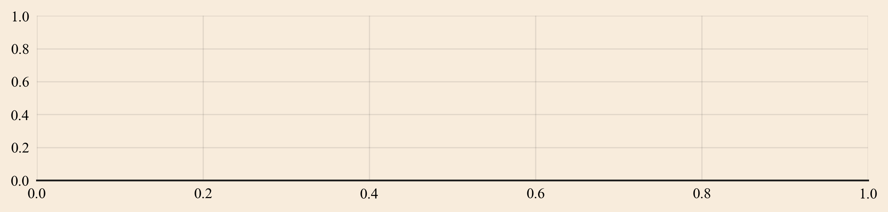

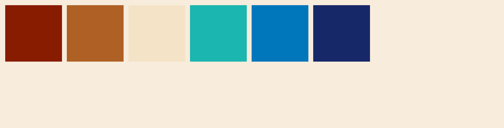

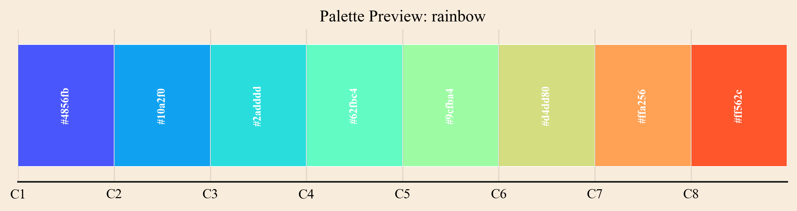

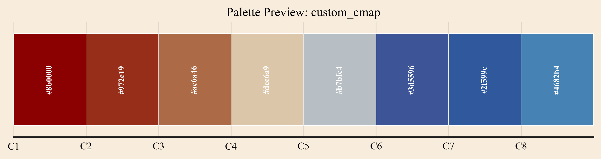

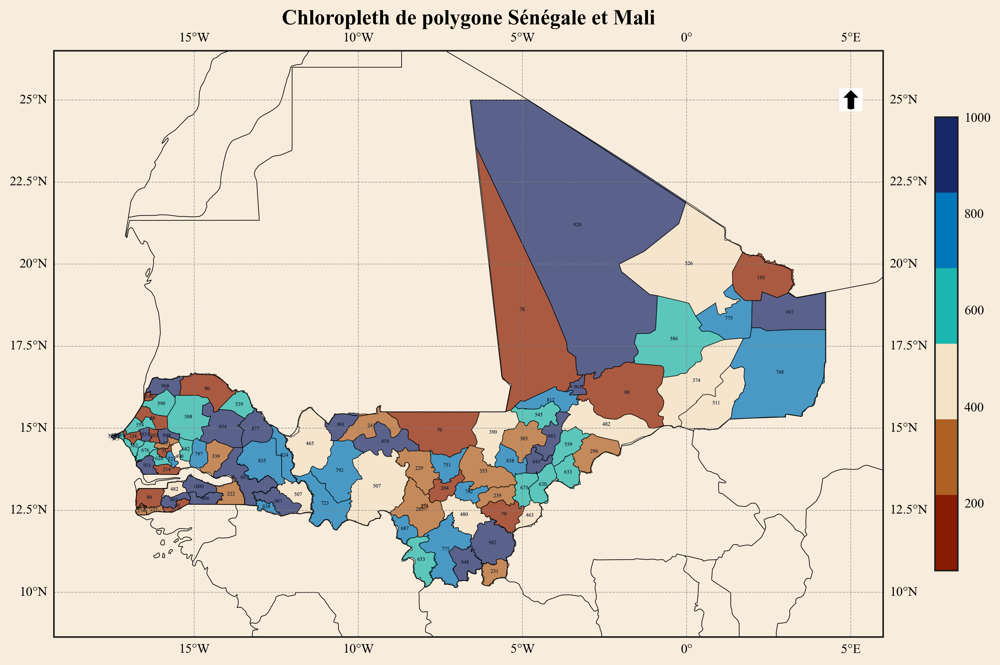

Changeons le style en dark_background

``` python
set_style("dark_background")
carte3 = Map (figsize="A4",title="Chloropleth de polygone Sénégale et Mali")
carte3.add_polygons_cloropleth(gdf=data_sen_mali,column_to_plot="data",cmap="Coconut")
carte3.add_labels(gdf=data_sen_mali,label_column="data",fontsize=4,outline_width=0)
carte3.add_gridlines()
carte3.add_arrow(1,position=(5,25),zoom=0.03)
carte3.set_font(get_fonts("time")[0])
carte3.show()
```

    ✅ Style Matplotlib appliqué : dark_background
    📄 Format de papier: A4 (landscape) - Dimensions: 210 x 297 mm - Figure: 11.7" x 8.3"
    Warning: No CRS defined for geodf. Setting default CRS to EPSG:4326

    WARNING:svglib.svglib:Can't handle color: param(outline)

    📊 Centrage intelligent appliqué:
       Format: A4 (landscape)
       Ratio figure: 1.41
       Ratio données: 1.47
       Étendue: [-19.27, 5.99, 8.64, 26.50]
    📊 Centrage intelligent appliqué:
       Format: A4 (landscape)
       Ratio figure: 1.41
       Ratio données: 1.47
       Étendue: [-19.27, 5.99, 8.64, 26.50]

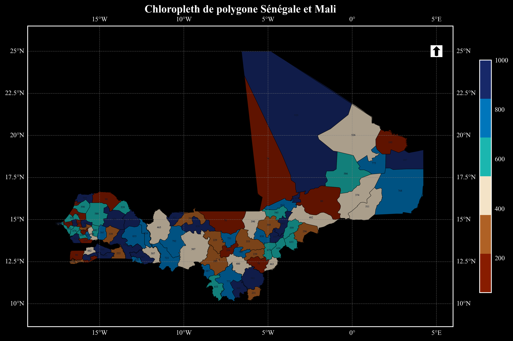

``` python
get_fonts("script")
```

    ['Brush Script MT',
     'Edwardian Script ITC',
     'Freestyle Script',
     'French Script MT',
     'Kunstler Script',
     'Matura MT Script Capitals',
     'Palace Script MT',
     'Script MT Bold',
     'Segoe Script',
     'Vladimir Script']

``` python
carteRivers=Map("A4",title="Réseau hydrographique de l'Afrique")
carteRivers.set_font("Freestyle Script", size=120)
carteRivers.add_lines(gdf=rivers_africa,linewidth=0.1,color="white",column="ORD_FLOW",cmap="managua")
list(map(lambda spine: spine.set_visible(False), carteRivers.ax.spines.values()))
carteRivers.show()
```

    📄 Format de papier: A4 (landscape) - Dimensions: 210 x 297 mm - Figure: 11.7" x 8.3"
    📊 Centrage intelligent appliqué:
       Format: A4 (landscape)
       Ratio figure: 1.41
       Ratio données: 1.00
       Étendue: [-42.99, 79.41, -42.01, 44.54]

``` python
rivers_civ=clip_gdf_by_mask(rivers_africa,civ_data)
rivers_civ.head()
```

    c:\Users\kanic\OneDrive\cartograpy\cartograpy\processing.py:494: UserWarning: gdf_emprise n'a pas de CRS défini. Attribution du CRS par défaut: EPSG:4326
      warnings.warn(f"gdf_emprise n'a pas de CRS défini. Attribution du CRS par défaut: {crs}")
    c:\Users\kanic\OneDrive\cartograpy\cartograpy\processing.py:502: DeprecationWarning: The 'unary_union' attribute is deprecated, use the 'union_all()' method instead.
      emprise_totale = gdf_emprise.geometry.unary_union

<div>
<style scoped>
    .dataframe tbody tr th:only-of-type {
        vertical-align: middle;
    }

    .dataframe tbody tr th {
        vertical-align: top;
    }

    .dataframe thead th {
        text-align: right;
    }
</style>

<table class="dataframe" data-quarto-postprocess="true" data-border="1">
<thead>
<tr style="text-align: right;">
<th data-quarto-table-cell-role="th"></th>
<th data-quarto-table-cell-role="th">HYRIV_ID</th>
<th data-quarto-table-cell-role="th">NEXT_DOWN</th>
<th data-quarto-table-cell-role="th">MAIN_RIV</th>
<th data-quarto-table-cell-role="th">LENGTH_KM</th>
<th data-quarto-table-cell-role="th">DIST_DN_KM</th>
<th data-quarto-table-cell-role="th">DIST_UP_KM</th>
<th data-quarto-table-cell-role="th">CATCH_SKM</th>
<th data-quarto-table-cell-role="th">UPLAND_SKM</th>
<th data-quarto-table-cell-role="th">ENDORHEIC</th>
<th data-quarto-table-cell-role="th">DIS_AV_CMS</th>
<th data-quarto-table-cell-role="th">ORD_STRA</th>
<th data-quarto-table-cell-role="th">ORD_CLAS</th>
<th data-quarto-table-cell-role="th">ORD_FLOW</th>
<th data-quarto-table-cell-role="th">HYBAS_L12</th>
<th data-quarto-table-cell-role="th">geometry</th>
</tr>
</thead>
<tbody>
<tr>
<td data-quarto-table-cell-role="th">601281</td>
<td>10601282</td>
<td>10600136</td>
<td>10877687</td>
<td>3.85</td>
<td>3711.6</td>
<td>8.3</td>
<td>21.09</td>
<td>21.1</td>
<td>0</td>
<td>0.103</td>
<td>1</td>
<td>5</td>
<td>7</td>
<td>1120784650</td>
<td>LINESTRING (-6.26875 10.72917, -6.26875 10.73999)</td>
</tr>
<tr>
<td data-quarto-table-cell-role="th">601419</td>
<td>10601420</td>
<td>10599829</td>
<td>10877687</td>
<td>5.83</td>
<td>3708.9</td>
<td>300.2</td>
<td>26.15</td>
<td>10211.1</td>
<td>0</td>
<td>100.955</td>
<td>4</td>
<td>3</td>
<td>4</td>
<td>1120784660</td>
<td>LINESTRING (-6.22708 10.72708, -6.22292 10.731...</td>
</tr>
<tr>
<td data-quarto-table-cell-role="th">601851</td>
<td>10601852</td>
<td>10601420</td>
<td>10877687</td>
<td>2.67</td>
<td>3714.5</td>
<td>42.2</td>
<td>3.59</td>
<td>426.6</td>
<td>0</td>
<td>2.249</td>
<td>3</td>
<td>4</td>
<td>6</td>
<td>1120786120</td>
<td>LINESTRING (-6.22188 10.72604, -6.22292 10.727...</td>
</tr>
<tr>
<td data-quarto-table-cell-role="th">602019</td>
<td>10602020</td>
<td>10603004</td>
<td>10877687</td>
<td>2.44</td>
<td>3741.0</td>
<td>7.3</td>
<td>22.15</td>
<td>22.1</td>
<td>0</td>
<td>0.113</td>
<td>1</td>
<td>5</td>
<td>7</td>
<td>1121946950</td>
<td>LINESTRING (-6.40542 10.71375, -6.40208 10.71042)</td>
</tr>
<tr>
<td data-quarto-table-cell-role="th">602170</td>
<td>10602171</td>
<td>10603004</td>
<td>10877687</td>
<td>0.97</td>
<td>3741.0</td>
<td>5.7</td>
<td>11.39</td>
<td>11.4</td>
<td>0</td>
<td>0.060</td>
<td>1</td>
<td>6</td>
<td>8</td>
<td>1121946950</td>
<td>LINESTRING (-6.40833 10.70417, -6.40208 10.71042)</td>
</tr>
</tbody>
</table>

</div>

``` python
set_style("cyberpunk")
```

    ✅ Style Matplotlib appliqué : cyberpunk

``` python
carteRiversCiv=Map("A4",title="Carte hydrographique de la Côte d'Ivoire")
carteRiversCiv.add_lines(gdf=rivers_civ,linewidth=0.5,cmap="Blues",column="ORD_FLOW")
carteRiversCiv.add_gridlines()
carteRiversCiv.set_title("Carte du reseau hydrographique de la Côte d'Ivoire", pad=40,fontsize=20,color="white")
carteRiversCiv.create_legend_from_column(gdf=rivers_civ,column="ORD_FLOW",cmap="Blues",element_type="line")
carteRiversCiv.legend_presets(preset="default",title="Légende",loc="lower right",facecolor="black")
carteRiversCiv.set_font(get_fonts("time")[0])
carteRiversCiv.show()
carteRiversCiv.save(dpi=600,filename="carte reseau hydrographique ci")
```

    📄 Format de papier: A4 (landscape) - Dimensions: 210 x 297 mm - Figure: 11.7" x 8.3"
    🛑Element de légende ajouté [<matplotlib.lines.Line2D object at 0x000001F33BAA60D0>, <matplotlib.lines.Line2D object at 0x000001F33BAA6210>, <matplotlib.lines.Line2D object at 0x000001F33BAA6350>, <matplotlib.lines.Line2D object at 0x000001F33BAA6490>, <matplotlib.lines.Line2D object at 0x000001F33BAA65D0>]
    ✅ Légende personnalisée créée avec 5 éléments
    📊 Légende créée pour la colonne 'ORD_FLOW' avec 5 éléments
    {'fontsize': 10, 'frameon': True, 'fancybox': True, 'shadow': True, 'framealpha': 0.9, 'facecolor': 'black', 'edgecolor': 'black', 'title': 'Légende', 'loc': 'lower right'}
    🛑Element de légende ajouté None
    ✅ Légende personnalisée créée avec 5 éléments
    🎨 Préréglage 'default' appliqué à la légende
    📊 Centrage intelligent appliqué:
       Format: A4 (landscape)
       Ratio figure: 1.41
       Ratio données: 0.96
       Étendue: [-10.94, -0.13, 3.73, 11.38]
    🛑Element de légende ajouté None
    ✅ Légende personnalisée créée avec 5 éléments

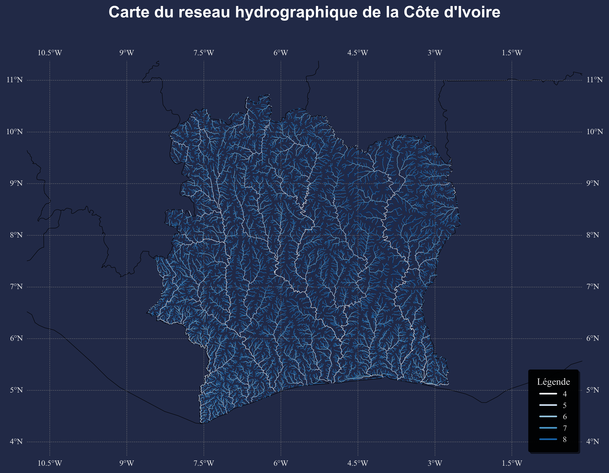

    📊 Centrage intelligent appliqué:
       Format: A4 (landscape)
       Ratio figure: 1.41
       Ratio données: 0.96
       Étendue: [-10.94, -0.13, 3.73, 11.38]
    🛑Element de légende ajouté None
    ✅ Légende personnalisée créée avec 5 éléments

    <Figure size 640x480 with 0 Axes>

    Carte sauvegardée: carte reseau hydrographique ci

    <Figure size 640x480 with 0 Axes>

#### **Ajouter des couches de tous les types**

``` python
font=get_fonts("da")[0]
font
```

    'Candara'

``` python
print(list_all_styles())
```

    {'matplotlib': ['Solarize_Light2', '_classic_test_patch', '_mpl-gallery', '_mpl-gallery-nogrid', 'bmh', 'bright', 'cjk-jp-font', 'cjk-kr-font', 'cjk-sc-font', 'cjk-tc-font', 'classic', 'cyberpunk', 'dark_background', 'fast', 'fivethirtyeight', 'ggplot', 'grayscale', 'grid', 'high-contrast', 'high-vis', 'ieee', 'latex-sans', 'light', 'muted', 'nature', 'no-latex', 'notebook', 'petroff10', 'pgf', 'retro', 'russian-font', 'sans', 'scatter', 'science', 'seaborn-v0_8', 'seaborn-v0_8-bright', 'seaborn-v0_8-colorblind', 'seaborn-v0_8-dark', 'seaborn-v0_8-dark-palette', 'seaborn-v0_8-darkgrid', 'seaborn-v0_8-deep', 'seaborn-v0_8-muted', 'seaborn-v0_8-notebook', 'seaborn-v0_8-paper', 'seaborn-v0_8-pastel', 'seaborn-v0_8-poster', 'seaborn-v0_8-talk', 'seaborn-v0_8-ticks', 'seaborn-v0_8-white', 'seaborn-v0_8-whitegrid', 'std-colors', 'tableau-colorblind10', 'turkish-font', 'vibrant'], 'seaborn': ['darkgrid', 'whitegrid', 'dark', 'white', 'ticks'], 'mplcyberpunk': ['cyberpunk'], 'SciencePlots': ['science', 'nature', 'ieee', 'vibrant', 'bright', 'muted', 'retro', 'notebook', 'scatter', 'grid', 'seaborn-v0_8']}

``` python
data_sen_mali.head()
```

<div>
<style scoped>
    .dataframe tbody tr th:only-of-type {
        vertical-align: middle;
    }

    .dataframe tbody tr th {
        vertical-align: top;
    }

    .dataframe thead th {
        text-align: right;
    }
</style>

<table class="dataframe" data-quarto-postprocess="true" data-border="1">
<thead>
<tr style="text-align: right;">
<th data-quarto-table-cell-role="th"></th>
<th data-quarto-table-cell-role="th">geometry</th>
<th data-quarto-table-cell-role="th">shapeName</th>
<th data-quarto-table-cell-role="th">shapeISO</th>
<th data-quarto-table-cell-role="th">shapeID</th>
<th data-quarto-table-cell-role="th">shapeGroup</th>
<th data-quarto-table-cell-role="th">shapeType</th>
<th data-quarto-table-cell-role="th">data</th>
</tr>
</thead>
<tbody>
<tr>
<td data-quarto-table-cell-role="th">0</td>
<td>POLYGON ((-11.88782 13.38481, -11.88765 13.391...</td>
<td>Bakel</td>
<td></td>
<td>50182788B16013842146029</td>
<td>SEN</td>
<td>ADM2</td>
<td>83</td>
</tr>
<tr>
<td data-quarto-table-cell-role="th">1</td>
<td>POLYGON ((-16.38592 15.02258, -16.40452 15.023...</td>
<td>Bambey</td>
<td></td>
<td>50182788B75300917140294</td>
<td>SEN</td>
<td>ADM2</td>
<td>337</td>
</tr>
<tr>
<td data-quarto-table-cell-role="th">2</td>
<td>POLYGON ((-15.9775 12.88596, -15.97446 12.8904...</td>
<td>Bignona</td>
<td></td>
<td>50182788B19391387689457</td>
<td>SEN</td>
<td>ADM2</td>
<td>299</td>
</tr>
<tr>
<td data-quarto-table-cell-role="th">3</td>
<td>POLYGON ((-15.59024 13.8291, -15.58246 13.8437...</td>
<td>Birkelane</td>
<td></td>
<td>50182788B56779252201559</td>
<td>SEN</td>
<td>ADM2</td>
<td>621</td>
</tr>
<tr>
<td data-quarto-table-cell-role="th">4</td>
<td>POLYGON ((-15.9775 12.88596, -15.97 12.89171, ...</td>
<td>Bounkiling</td>
<td></td>
<td>50182788B68388966372963</td>
<td>SEN</td>
<td>ADM2</td>
<td>181</td>
</tr>
</tbody>
</table>

</div>

``` python
cmap=load_cmap("Juarez")
plt.style.use("default")
carte5=Map(figsize="A4",title="")
carte5.add_layer(data_sen_mali,facecolor="red",alpha=0.8,column="shapeGroup",cmap=cmap,linewidth=0.5, label="Découpage administratif")
centroide_sen_mal=centroids(data_sen_mali)
carte5.add_layer(centroide_sen_mal,color="yellow", label="Centroïde",size=70,alpha=0.5)
carte5.legend_presets(loc="lower right")
carte5.set_font(font)
carte5.set_paper(paper_format="A4",orientation="landscape")
carte5.add_arrow(9,(4.4,25),0.4,"gray")
carte5.add_gridlines()
carte5.show()
```

    📄 Format de papier: A4 (landscape) - Dimensions: 210 x 297 mm - Figure: 11.7" x 8.3"
    ⚠️  Attention: Aucun CRS défini. Attribution du CRS par défaut: EPSG:4326
    ['Polygon' 'MultiPolygon']
    ⚠️  Attention: Aucun CRS défini. Attribution du CRS par défaut: EPSG:4326
    ['Point']
    {'fontsize': 10, 'frameon': True, 'fancybox': True, 'shadow': True, 'framealpha': 0.9, 'facecolor': 'white', 'edgecolor': 'black', 'loc': 'lower right'}
    🛑Element de légende ajouté None
    ✅ Légende personnalisée créée avec 2 éléments
    🎨 Préréglage 'default' appliqué à la légende
    📄 Format mis à jour: A4 (landscape) - Dimensions: 210 x 297 mm - Figure: 11.7" x 8.3"

    WARNING:svglib.svglib:Unable to find a suitable font for 'font-family:OPEN SANS', weight:normal, style:normal
    WARNING:svglib.svglib:Unable to find a suitable font for 'font-family:OPEN SANS', weight:normal, style:normal
    WARNING:svglib.svglib:Unable to find a suitable font for 'font-family:Adobe Heiti Std R', weight:normal, style:normal
    WARNING:svglib.svglib:Can't handle color: param(outline)
    WARNING:svglib.svglib:Can't handle color: param(outline)

    📊 Centrage intelligent appliqué:
       Format: A4 (landscape)
       Ratio figure: 1.41
       Ratio données: 1.47
       Étendue: [-19.27, 5.99, 8.64, 26.50]
    🛑Element de légende ajouté None
    ✅ Légende personnalisée créée avec 2 éléments

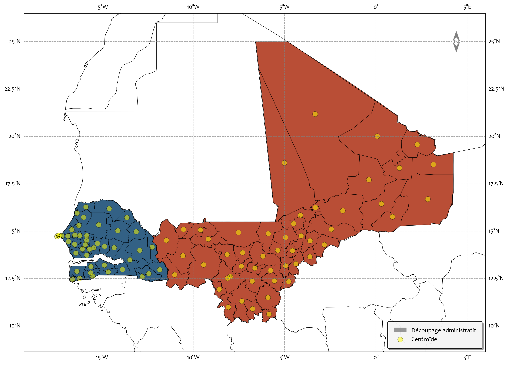
