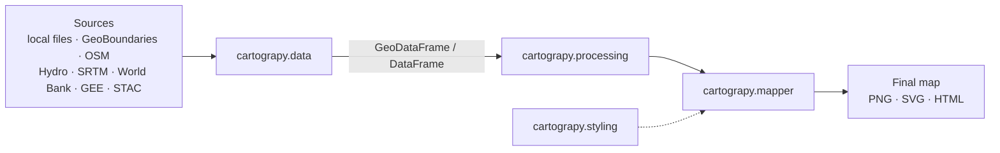
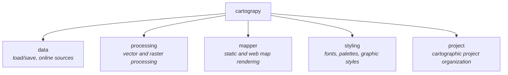

# cartograpy

[](https://pypi.org/project/cartograpy/)
[](https://pypi.org/project/cartograpy/)
[](https://github.com/Mr-KAM/cartograpy/blob/master/LICENSE)
[](https://mr-kam.github.io/cartograpy/)

**Mapping in Python, the way it was always meant to be.**

Cartograpy is a Python package for loading, processing, and mapping
geographic data in a few lines of code: from a country's administrative
boundaries to the final static map, ready to export, anywhere in the world.


## Features

- **Data**: download administrative boundaries (`GeoBoundaries`),
  OpenStreetMap data, hydrography, geocoding, elevation (SRTM), World Bank
  indicators, weather/climate series (NASA POWER), Google Earth Engine
  imagery, or STAC catalogs (Planetary Computer, AWS Earth Search…) in one
  line; results returned as `GeoDataFrame`/`DataFrame`/`RasterTools`.
- **Processing**: import/export all common formats (Shapefile, GeoJSON, KML,
  GPX, GPKG, CSV, Parquet…), reproject, clip, merge, compute centroids,
  joins, and dynamic attributes (`VectorTools`, `RasterTools`); automatic
  UTM projection for accurate metric distances/areas, lazy/windowed raster
  loading for large files.
- **Mapping**: choropleth, point, polygon, raster, bivariate, or hexbin maps
  with the `Map` class (north arrow, scale bar, situation inset map,
  legends, graticule, PNG/SVG export); publication-ready multi-panel plates
  (`Layout`); interactive web maps (`WebMap`, Folium/lonboard/kepler.gl
  engines).
- **Styling**: Google Fonts, 16 built-in palettes + seaborn/matplotlib,
  graphic styles (`scienceplots`, `mplcyberpunk`).
- **Project**: `Project` structures folders and outputs, tracks the CRS,
  and validates dataset integrity.
- **CLI**: a `cartograpy` command (`init`, `fetch`, `inspect`, `convert`,
  `map`, `doctor`) for common tasks without writing a Python script.

## Installation

```bash
pip install cartograpy
```

> [!NOTE]
> Python 3.11+. Use a virtual environment to avoid dependency conflicts
> (`venv`, `conda`, `uv`…). On Windows, if the GDAL/GEOS/PROJ installation
> fails, install `geopandas rasterio cartopy fiona` via `conda-forge` before
> `pip install cartograpy`.

Interactive web maps (`WebMap`) need the optional `webmap` extra
(`folium`, `lonboard`, `keplergl`, `rio-tiler`):

```bash
pip install cartograpy[webmap]
```

## How it works


<details><summary>Mermaid diagram source</summary>


```mermaid
flowchart LR
    S["Sources<br/>local files · GeoBoundaries · OSM<br/>Hydro · SRTM · World Bank · GEE · STAC"] --> D["cartograpy.data"]
    D -->|"GeoDataFrame / DataFrame"| P["cartograpy.processing"]
    P --> M["cartograpy.mapper"]
    ST["cartograpy.styling"] -.-> M
    M --> O["Final map<br/>PNG · SVG · HTML"]
```

</details>

## Quick start

```python
from cartograpy.data import Bound
from cartograpy.mapper import Map

bound = Bound()
civ = bound.get_admin("CIV", adm=0)          # national boundaries, via GeoBoundaries

m = Map(title="Côte d'Ivoire")
m.add_polygons(civ, facecolor="lightyellow", edge_color="black", alpha=1)
m.add_north_arrow()
m.add_scale_bar()
m.show()

m.save("cote-divoire.png", dpi=300)          # print-ready export
```

## Command line

Common tasks without writing Python, via the `cartograpy` command installed
with the package:

```bash
cartograpy init mon_projet
cartograpy fetch boundary CIV --adm 2
cartograpy map regions.gpkg --column population -o map.png
cartograpy doctor        # check Python, GDAL/PROJ/GEOS, core and optional deps
```

## The modules


<details><summary>Mermaid diagram source</summary>


```mermaid
graph TD
    A["cartograpy"] --> D["data<br/><i>load/save, online sources</i>"]
    A --> P["processing<br/><i>vector and raster processing</i>"]
    A --> M["mapper<br/><i>static and web map rendering</i>"]
    A --> S["styling<br/><i>fonts, palettes, graphic styles</i>"]
    A --> PR["project<br/><i>cartographic project organization</i>"]
```

</details>

Everything is importable from the root (`from cartograpy import Map, Bound,
Project`) or from each submodule.

## Going further

Full documentation (API reference, step-by-step guides, gallery) is
available at **[mr-kam.github.io/cartograpy](https://mr-kam.github.io/cartograpy/)**.

For an interactive tour of all the features, see the notebook
[`notebooks/README.ipynb`](https://github.com/Mr-KAM/cartograpy/blob/master/notebooks/README.ipynb).

## License

MIT: see [`LICENSE`](https://github.com/Mr-KAM/cartograpy/blob/master/LICENSE).
