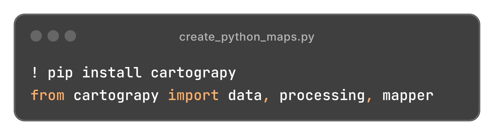
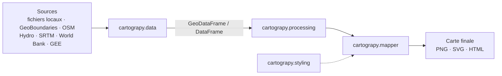
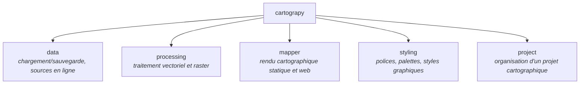

# cartograpy

[](https://pypi.org/project/cartograpy/)
[](https://pypi.org/project/cartograpy/)
[](LICENSE)
[](https://mr-kam.github.io/cartograpy/)

**Mapping in Python, the way it was always meant to be.**

Cartograpy est un package Python pour charger, traiter et cartographier des
données géographiques en quelques lignes de code : des frontières
administratives d'un pays jusqu'à la carte statique finale, prête à exporter,
partout dans le monde.



## Fonctionnalités

- **Données** : téléchargez en une ligne des frontières administratives
  (`GeoBoundaries`), des données OpenStreetMap, hydrographiques, de géocodage,
  d'altitude (SRTM), des indicateurs World Bank, des séries météo/climat
  (NASA POWER) ou de l'imagerie Google Earth Engine ; résultats renvoyés en
  `GeoDataFrame`/`DataFrame`.
- **Traitement** : importez/exportez tous les formats courants (Shapefile,
  GeoJSON, KML, GPX, GPKG, CSV, Parquet…), reprojetez, découpez, fusionnez,
  calculez centroïdes, jointures et attributs dynamiques (`VectorTools`,
  `RasterTools`).
- **Cartographie** : cartes choroplèthes, points, polygones, raster, bivariées
  ou hexbin avec la classe `Map` : flèche du nord, barre d'échelle, mini-carte
  de situation, légendes, graticule, export PNG/SVG.
- **Style** : polices Google Fonts, 16 palettes intégrées + seaborn/matplotlib,
  styles graphiques (`scienceplots`, `mplcyberpunk`).
- **Projet** : `Project` structure dossiers et sorties, garde une trace du CRS
  et valide l'intégrité des jeux de données.

## Installation

```bash
pip install cartograpy
```

> [!NOTE]
> Python 3.11+. Utilisez un environnement virtuel pour éviter les conflits de
> dépendances (`venv`, `conda`, `uv`…). Sur Windows, si l'installation de
> GDAL/GEOS/PROJ échoue, installez `geopandas rasterio cartopy fiona` via
> `conda-forge` avant `pip install cartograpy`.

## Comment ça marche


```mermaid
flowchart LR
    S["Sources<br/>fichiers locaux · GeoBoundaries · OSM<br/>Hydro · SRTM · World Bank · GEE"] --> D["cartograpy.data"]
    D -->|"GeoDataFrame / DataFrame"| P["cartograpy.processing"]
    P --> M["cartograpy.mapper"]
    ST["cartograpy.styling"] -.-> M
    M --> O["Carte finale<br/>PNG · SVG · HTML"]
```

## Démarrage rapide

```python
from cartograpy.data import Bound
from cartograpy.mapper import Map

bound = Bound()
civ = bound.get_admin("CIV", adm=0)          # frontières nationales, via GeoBoundaries

m = Map(title="Côte d'Ivoire")
m.add_polygons(civ, facecolor="lightyellow", edge_color="black", alpha=1)
m.add_north_arrow()
m.add_scale_bar()
m.show()

m.save("cote-divoire.png", dpi=300)          # export prêt à imprimer
```

## Les modules


```mermaid
graph TD
    A["cartograpy"] --> D["data<br/><i>chargement/sauvegarde, sources en ligne</i>"]
    A --> P["processing<br/><i>traitement vectoriel et raster</i>"]
    A --> M["mapper<br/><i>rendu cartographique statique et web</i>"]
    A --> S["styling<br/><i>polices, palettes, styles graphiques</i>"]
    A --> PR["project<br/><i>organisation d'un projet cartographique</i>"]
```

Tout est importable depuis la racine (`from cartograpy import Map, Bound,
Project`) ou depuis chaque sous-module.

## Aller plus loin

La documentation complète (référence de l'API, guides pas-à-pas, galerie) est
disponible sur **[mr-kam.github.io/cartograpy](https://mr-kam.github.io/cartograpy/)**.

Pour une visite guidée interactive de toutes les fonctionnalités, voir le
notebook [`notebooks/README.ipynb`](notebooks/README.ipynb).

## Licence

MIT : voir [`LICENSE`](LICENSE).
